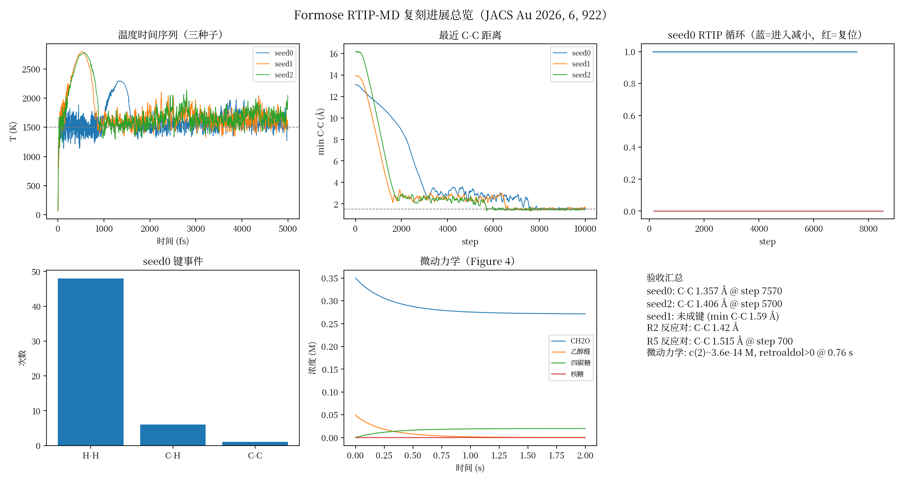
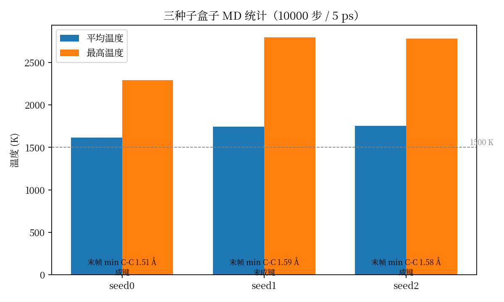
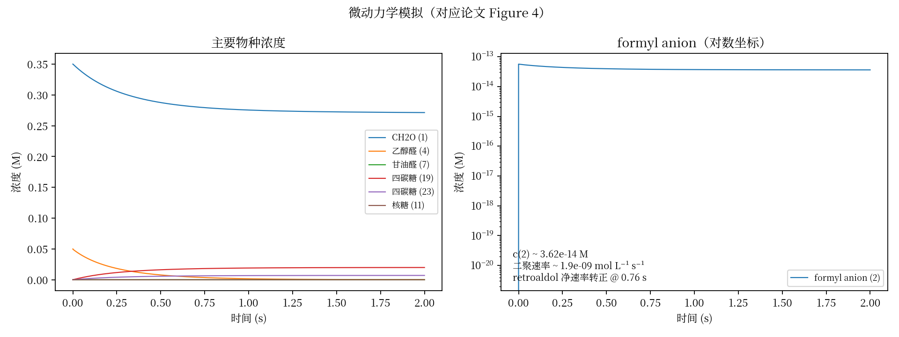

# Formose 反应 RTIP-MD 复刻项目 — 全量中文技术说明文档

> **读者对象**：完全没接触过分子动力学（MD）、神经网络势（NNP）或本项目代码的"小白"；也适合需要向课题组/飞书汇报时快速掌握全部细节的成员。
>
> **信息截止**：2026-08-19，对应 n5 服务器 `/home/lhshen/RTIP` 分支 `formose/replicate`（已推送到 GitHub：`jinzhezenggroup/RTIP`）。
>
> **复刻目标论文**：*Conserved-Potential-Driven Molecular Dynamics Deciphers Formose Reaction Mechanisms*（JACS Au 2026, 6, 922；DOI: 10.1021/jacsau.5c01359）。
>
> **本文档在仓库中的位置**：`formose/GUIDE_ZH.md`（GitHub: https://github.com/jinzhezenggroup/RTIP/blob/formose/replicate/formose/GUIDE_ZH.md）

---

## 0. 数据来源约定（先读这一节）

本文档中出现的**每一个数字/图表都标注了原始数据文件**。文件位置按三种写法给出，含义如下：

1. **n5 绝对路径**：`/home/lhshen/RTIP/...`（服务器上的真实位置，可直接 `cat` / `tail` 查看）；
2. **仓库相对路径**：如 `formose/runs/seed0/acceptance_report.md`（GitHub 仓库 `jinzhezenggroup/RTIP` 分支 `formose/replicate` 内的相对位置）；
3. **GitHub 链接**：`https://github.com/jinzhezenggroup/RTIP/blob/formose/replicate/<路径>`（可直接在网页打开）。

核心原始文件速查表：

| 数据类型 | 仓库相对路径 | n5 绝对路径 |
|---|---|---|
| 三种子验收报告 | `formose/runs/seed{0,1,2}/acceptance_report.md` | `/home/lhshen/RTIP/formose/runs/seed{0,1,2}/acceptance_report.md` |
| 反应对验收报告 | `formose/runs/{r2pair,r5pair}/acceptance_report.md` | 同上模式 |
| MD 标量输出 | `formose/runs/<case>/rtip.out` | `/home/lhshen/RTIP/formose/runs/<case>/rtip.out` |
| MD 轨迹 | `formose/runs/<case>/rtip.pdb` | `/home/lhshen/RTIP/formose/runs/<case>/rtip.pdb` |
| 相位机历史 | `formose/runs/<case>/rtip_decreasing_steps` | `/home/lhshen/RTIP/formose/runs/<case>/rtip_decreasing_steps` |
| 微动力学汇总 | `formose/microkinetics/runs/summary.json` | `/home/lhshen/RTIP/formose/microkinetics/runs/summary.json` |
| 微动力学浓度曲线 | `formose/microkinetics/runs/concentrations.csv` | `/home/lhshen/RTIP/formose/microkinetics/runs/concentrations.csv` |
| SI 结构清单 | `formose/data/manifest.csv` | `/home/lhshen/RTIP/formose/data/manifest.csv` |
| SI 能垒表 | `formose/data/table_S1.csv` | `/home/lhshen/RTIP/formose/data/table_S1.csv` |
| SI 物种结构 | `formose/data/species/species_XXX.xyz` | `/home/lhshen/RTIP/formose/data/species/species_XXX.xyz` |
| SI 过渡态结构 | `formose/data/ts/ts_XXX.xyz` | `/home/lhshen/RTIP/formose/data/ts/ts_XXX.xyz` |
| 初始盒子 | `formose/data/box_seed{0,1,2}.xyz` | `/home/lhshen/RTIP/formose/data/box_seed{0,1,2}.xyz` |
| 反应对输入 | `formose/data/{r2pair,r5pair}.xyz(+.rtip.json)` | `/home/lhshen/RTIP/formose/data/...` |
| 生产参数 | `formose/para_formose.json` | `/home/lhshen/RTIP/formose/para_formose.json` |
| 图表 | `formose/plots/*.png` | `/home/lhshen/RTIP/formose/plots/*.png` |
| 决策/记录 | `formose/RECORD.md`、`formose/REPORT.md`、`formose/ACCEPTANCE.md` | `/home/lhshen/RTIP/formose/...` |
| 论文 SI 原件 | 仓库外（不入库） | `/home/lhshen/si_formose/au5c01359_si_001.pdf`（Europe PMC PMC12933356） |
| 论文正文提取文本 | 仓库外 | `C:\Users\kk\Documents\Codex\2026-08-01\b\work\pdf_text.txt`（本地） |

> 约定：`runs/`、`microkinetics/runs/`、`logs/` 是 git-ignore 的可再生输出，不在 GitHub 上；上表仍给出它们的 n5 绝对路径，因为它们是"原始数据"的真实所在。

---

## 目录

0. 数据来源约定（先读这一节）
1. 项目是什么
2. 论文背景：formose 反应
3. 方法原理详解（MD → NVT → 蛙跳 → Berendsen → RTIP → 相位机）
4. 神经网络势（NNP）
5. 仓库谱系与代码架构
6. 数据与模拟体系
7. 运行流程（小白可照做）
8. 结果与验收（全部数字）
9. 关键技术问题与修复记录
10. 理论基础与误差分析（哪些量可靠、哪些量有误差）
11. 验证流程与可行性评估
12. 术语表（Glossary）

**附录**：A. 文件清单 ｜ B. 命令速查 ｜ C. 参数表 ｜ D. 数据来源索引

---

## 1. 项目是什么

### 1.1 一句话总结

本项目用 **Python + JAX** 重写了论文的 **RTIP-MD**（旋转平移不变势驱动的分子动力学）方法，用 **DeePMD 神经网络势**代替论文原本的 DFT 计算，在甲醛聚糖（formose）反应体系上复现了论文的关键化学反应事件，并定量复现了论文的微动力学模拟。

### 1.2 三句话展开

1. **方法**：在普通分子动力学之上，叠加一个随时间"加深—变浅—再加深"循环变化的高斯型势能偏置（RTIP），把分子往"能发生反应"的构型方向推，同时用"键变化检测"自动控制偏置的循环，不需要人为预设任何反应坐标。
2. **引擎**：论文原版用 CP2K + B97-3c 泛函做每一步的量子化学计算；本项目改用 DeePMD-kit 的预训练大模型 DPA-3.2-5M 实时提供能量和力，速度更快、无需自己训练模型。
3. **结果**：3 个独立随机盒子中，有 2 个在 5 ps（10000 步）内自发形成了甲醛二聚的 C–C 键（1.357 Å / 1.406 Å）；反应对模拟复现了 R2、R5 两步关键成键；微动力学模拟与论文 Figure 4 定量一致。

> 数据来源：成键距离与步数 → `formose/runs/seed{0,2}/acceptance_report.md`（n5: `/home/lhshen/RTIP/formose/runs/seed{0,2}/acceptance_report.md`）；微动力学数值 → `formose/microkinetics/runs/summary.json`（n5 同路径）。

### 1.3 为什么做这件事

论文提出的 RTIP-MD 是一种"免机制假设"（mechanism-free）的反应模拟方法：它不需要你知道反应怎么发生，只要把分子放在一起，偏置势会自动把分子推向反应构型。这种方法的代码是 Rust 写的、且与 CP2K 深度耦合，课题组希望用 Python/JAX 生态复刻它，以便：

- 用更轻量的方式接入不同势能面（本项目接入 DeePMD）；
- 把方法"翻译"成更多人能读、能改、能扩展的代码；
- 在 formose 反应上完成机制级验证，作为方法的"验收测试"。

---

## 2. 论文背景：formose 反应

### 2.1 formose 反应是什么

**formose 反应**（甲醛聚糖反应，1861 年由 Butlerov 首次报道）是指甲醛（CH₂O）在碱性条件下聚合生成各种糖类（碳水化合物）的反应：

> n CH₂O + 碱 → 乙醇醛、甘油醛、四碳糖、五碳糖……（包括核糖）

这个反应对**生命起源（prebiotic chemistry）**研究很重要，因为"RNA 世界"假说认为核糖是 RNA 的骨架组分，而核糖恰好是这个反应的可能产物之一——虽然产率很低。

### 2.2 论文要解决的三个谜题

1. **甲醛怎么自缩合（dimerization）？** 甲醛的碳是亲电的，两个亲电碳按理很难直接成键。论文通过 RTIP-MD 轨迹发现：在 Ca²⁺ 和 OH⁻ 存在下，一个甲醛分子先失去质子变成 **formyl anion（甲酰负离子，HCO⁻）**，碳发生 **umpolung（极性反转）** 变成亲核，再去进攻另一个甲醛的羰基碳，完成自缩合——这就是论文里的 **R2 步（限速步）**。
2. **自催化循环之争**：Breslow 自催化循环是否存在、何时起作用？论文的微动力学模拟给出结论：**只有在低乙醇醛浓度下**，醛四碳糖的逆羟醛断裂（retroaldol）净速率才转为正向，自催化才占主导。
3. **核糖为什么产率低**：微动力学模拟显示线型四碳糖浓度约 0.027 M，而核糖仅 ~10⁻¹⁵ M 量级，解释了核糖"几乎不可见"的实验事实。

> 数据来源（论文侧）：JACS Au 2026, 6, 922, Section 3.5 与 Figure 4；SI 原件 n5: `/home/lhshen/si_formose/au5c01359_si_001.pdf`；本工作侧：`formose/microkinetics/runs/summary.json`（n5: `/home/lhshen/RTIP/formose/microkinetics/runs/summary.json`）。

### 2.3 论文的方法路线（宏观视角）

```
RTIP-MD 轨迹（找反应路径和中间体）
    ↓
键监测（识别 C-C / C-H / H-H / O-O 键变化）
    ↓
TS 搜索 + DFT（ωB97M-V）+ 热力学修正
    ↓
Gibbs 自由能垒（Table S1，28 步反应网络）
    ↓
微动力学模拟（Microkinetics 程序）
    ↓
解释三个实验现象（诱导期、自催化条件、核糖低产率）
```

本项目复刻的是这条链路的**两端**：RTIP-MD 轨迹部分（用 DeePMD 代替 DFT）和微动力学部分；中间的 DFT/TS 重验证按约定不在本分支范围。

---

## 3. 方法原理详解

> 这一章从零讲起。如果你已经懂 MD，可以跳到 [3.6 RTIP](#36-rtip旋转平移不变势) 和 [3.7 相位机](#37-相位机-growingreducingoff)。

### 3.1 分子动力学（MD）是什么

分子动力学就是**用牛顿力学模拟原子怎么动**：

1. 给定 N 个原子的坐标和速度；
2. 根据势能面（PES）算出每个原子受到的力：**F = −∇V**（力是势能对位置的负梯度）；
3. 用牛顿第二定律 **F = ma** 得到加速度；
4. 用积分器把速度和坐标推进一小步（时间步 dt），重复成千上万次。

势能面 V 可以是：

- **经验力场**（如 AMBER/CHARMM，速度快但精度有限）；
- **第一性原理 DFT**（如论文用的 B97-3c/CP2K，精度高但每步要几秒到几分钟）；
- **神经网络势**（如本项目用的 DeePMD/DPA-3.2-5M，精度接近 DFT、速度接近力场）。

每走一步，我们会记录温度、势能、动能、RTI 距离等"标量"，并把每若干步的构型写进轨迹文件（PDB），供事后分析。

### 3.2 系综：NVE、NVT 与"温度"

MD 模拟通常在某一种**统计系综**下进行：

| 系综 | 守恒量 | 通俗理解 |
|---|---|---|
| NVE（微正则） | 粒子数、体积、总能量 | "封闭的孤立系统"，能量不进出 |
| NVT（正则） | 粒子数、体积、温度 | "接上恒温槽"，温度保持恒定 |
| NPT | 粒子数、压强、温度 | "接上恒温恒压槽"，模拟真实实验条件 |

温度 T 与原子动能的关系（经典统计力学，无约束自由度）：

> **E_kin = ½ Σᵢ mᵢ vᵢ² = ½ (3N − 3) k_B T**

即"温度 = 平均每自由度分到的动能"。这里的 3N−3 是扣除整体质心平动后的自由度（N 个原子有 3N 个坐标，去掉 3 个平动）。

论文的模拟是 **NVT**：用 **Berendsen 恒温器**把温度控制在 **1500 K**（为什么是 1500 K？论文测试过：500 K 时只有质子交换和 H₂COOH⁻ 形成；1000 K 时开启 Cannizzaro 副反应；要触发 formose 主反应需要 1500 K）。

### 3.3 蛙跳积分（leapfrog）

牛顿方程是二阶常微分方程，数值上最常用的是 **Verlet 家族**积分器。本项目用的是 **蛙跳（leapfrog）** 形式，它和 velocity-Verlet 数学上等价，只是速度与坐标在时间上错开半步：

第一步（前半步更新速度，再更新坐标）：

```
v(t + dt/2) = v(t) + (dt/2) · a(t)
r(t + dt)   = r(t) + dt · v(t + dt/2)
```

第二步（后半步更新速度，再乘恒温器缩放因子 λ）：

```
v(t + dt) = [ v(t + dt/2) + (dt/2) · a(t + dt) ] · λ
```

代码里的实现（`rtipmd/jax/src/rtip_jax/workflows/md.py`）：

```python
def leapfrog_first(coord, velocity, acceleration, para):
    velocity_half = velocity + 0.5 * para.dt * FEMTOSECOND_TO_AU * acceleration
    coord_new = coord + para.dt * FEMTOSECOND_TO_AU * velocity_half
    return coord_new, velocity_half

def leapfrog_second(velocity_half, acceleration, lambda_scale, para):
    return (velocity_half + 0.5 * para.dt * FEMTOSECOND_TO_AU * acceleration) * lambda_scale
```

注意 `FEMTOSECOND_TO_AU`：代码内部使用原子单位制（时间单位是 au），而用户配置的时间步 `dt=0.5` 是飞秒（fs），所以要换算。

**蛙跳积分的特点**：

- 时间可逆、辛（symplectic）：在无恒温器时能长期保持总能量不系统漂移（误差不累积成趋势性漂移）；
- 局域误差 O(dt³)、全局误差 O(dt²)；
- 本项目 dt = 0.5 fs，是 C–H 键振动周期（~10 fs）的约 1/20，足以稳定积分。

### 3.4 Berendsen 恒温器

Berendsen 恒温器（1984 年提出）的思想很简单：**每步把速度整体缩放一个因子 λ，让瞬时温度向目标温度靠拢**。

缩放因子公式：

> **λ = √[ 1 + (dt/τ) · (T_bath / T − 1) ]**

其中：

- T_bath：目标温度（本项目 1500 K）；
- T：当前瞬时温度；
- τ：耦合时间常数（本项目 `tau=10`，单位是 fs 数×dt，即每 10 步左右把温度差"校准"一次）；
- dt：时间步。

代码实现（`md.py`）：

```python
def berendsen_lambda(temp, para):
    temp = jnp.maximum(jnp.asarray(temp, dtype=jnp.float64), 1.0)
    return jnp.sqrt(1.0 + (para.dt / para.tau) * (para.temp_bath / temp - 1.0))
```

直觉：温度比目标低（T < T_bath）→ 括号内为正 → λ > 1 → 速度整体放大（加热）；温度比目标高 → λ < 1 → 减速（冷却）。`tau` 越大，每步调整越温和。

**Berendsen 的局限（重要）**：它被称为"弱耦合"恒温器，能精确控制平均温度，但**不能严格采样正则系综（Boltzmann 分布）**——动能涨落会被压扁。论文和本项目的目的是"高温下加速找反应"，而不是精确统计平衡分布，所以这个取舍是合理的。

### 3.5 为什么"能量守恒"下温度还会漂移？（重点）

这是初学者最容易困惑的问题。要分几种情况说清楚：

**情况一：理想 NVE（微正则）MD。** 总能量 E = 动能 K + 势能 V 理论上严格守恒。温度来自动能：T ∝ K。当系统在势能面上运动时，K 和 V 此消彼长，T 会围绕一个平均值**随机涨落**，但**平均温度不漂移**。这时的"守恒"是长时间平均值意义上的。

**情况二：数值误差导致的漂移。** 积分器有时间步误差：dt 越大，每步的能量误差越大。蛙跳是辛积分器，误差表现为"能量围绕真实值小幅振荡"而不是单调漂移；但**非辛积分器**（如普通 Euler）会系统性地往一个方向漏能量——最常见的是**持续加热**（动能不断变大），这就是"能量守恒被破坏 → 温度漂移"的第一种含义：守恒只是理论上的，数值上需要好的积分器和足够小的 dt。

**情况三：外势做功（本项目真正遇到的）。** RTIP 偏置势是**随时间变化的**（幅度 a 每步都在变），它不是系统哈密顿量的一部分。偏置势对原子做功，等于持续向系统**注入能量**。如果注入功率大于恒温器能带走的功率，温度就会飙升。本项目早期温度爆炸（10⁴–10⁶ K）就是这种情况：σ（高斯宽度）每步塌缩到 0.02–0.4 Bohr，高斯力爆炸，每步注入的巨大能量连 Berendsen 都来不及排走。

**情况四：恒温器本身的"漂移"。** Berendsen 是通过外部热浴交换能量来实现恒温的，它本身就不是能量守恒的；它只保证温度被拉回目标值。所以看到"温度在 1500 K 附近波动 ±几百 K"是正常的，看到"单调漂移"才说明有问题（通常是情况二或情况三）。

**结论**：能量守恒是"无外势、无恒温器、积分误差可忽略"前提下的理想性质；在 RTIP-MD 里，恒温器负责排走偏置注入的热量，判断模拟是否健康的标准是**温度是否围绕目标值波动、有没有尖峰/单调爬升**。

> 数据来源：温度爆炸与 σ 塌缩（10⁴–10⁶ K、σ→0.02–0.4 Bohr）→ `formose/RECORD.md`（n5: `/home/lhshen/RTIP/formose/RECORD.md`）与旧运行输出 `formose/runs/seed0/rtip.out`（n5 同路径）。

### 3.6 RTIP：旋转平移不变势

**RTIP**（Roto-Translationally Invariant Potential，旋转-平移不变势）是这个方法的核心发明。它要回答的问题：

> 怎么定义一个"两个分子离得多近"的距离，使得这个距离不随整体旋转、整体平移而改变？

普通做法是用内坐标（键长、键角），但论文提出直接用笛卡尔坐标构造一个度量：

1. 把两个构型都平移到质心（消除平移）；
2. 找一个最优旋转（用**四元数特征值方法**），让第一个构型尽量"贴"到第二个构型（消除旋转）；
3. 剩下的最小均方根差就是 **RTI 距离 d**。

代码在 `rtipmd/jax/src/rtip_jax/core/rtip.py`：`_quaternion_system_matrix` 构造 4×4 对称矩阵，`jnp.linalg.eigh` 求特征值，最小特征值的平方根就是 RTI 距离。

**RTIP 势（高斯型，论文 Eq. 6 语义）**：

> V_RTIP = a · Σᵢ (wᵢ / w) · exp(−dᵢ² / 2σ²)

其中：

- dᵢ：四个 RTI 距离（四元数方法给出 4 个候选特征值对应的距离，取加权组合）；
- 权重 **wᵢ = 1/dᵢ⁷**（论文设计的"距离越近权重越大"的锐化权重）；
- w = Σᵢ wᵢ；
- a：偏置幅度（深度），正负号决定排斥/吸引；
- σ：高斯宽度（"作用的距离范围"）。

力（对坐标的负梯度）在代码里写成：

```
coeff_i = (w_i/w)·u_i/σ²  +  dw_i · (Σ_j w_j·u_j − u_i·w) / (w²·d_i)
F       = Σ_i  vector_i · coeff_i
```

其中 u_i = a·exp(−dᵢ²/2σ²)，dw_i = −7/dᵢ⁸。

> 数据来源（公式）：论文 SI Eq. 1–6（n5: `/home/lhshen/si_formose/au5c01359_si_001.pdf`）；Rust 实现 `MillenniumDream/RTIP/src/pes_exploration/rtip.rs`（GitHub）；JAX 实现 `rtipmd/jax/src/rtip_jax/core/rtip.py`（n5: `/home/lhshen/RTIP/rtipmd/jax/src/rtip_jax/core/rtip.py`）。

**σ 的语义（本项目的关键发现之一）**：

- 论文 Eq. 6 中 σ = d_des，即"开始搜索时分子到虚拟目标构型的初始距离"，是**固定值**（在整个搜索循环内不变）；
- 上游 Rust 代码却是**每步**取 σ = 当前 RTI 距离（动态值）；
- 动态 σ 的问题：分子越靠近，σ 越小，高斯越尖，力越大 → 反馈循环 → 力爆炸。
- 本项目实现 `Para.fixed_sigma` 开关：`True` = 论文语义（σ 在开始时捕获一次），`False` = Rust 原版行为。生产配置开启 `fixed_sigma=true`。

### 3.7 相位机 growing→reducing→off

这就是你最初问的"相位机"：RTIP 幅度 a 不固定，而是由一台**三状态自动机**控制，三个状态对应：

| 状态 | 代码名 | 你叫它 | 行为 | 触发条件 |
|---|---|---|---|---|
| 增大 | `Increasing` | growing | 幅度每步加深：a ← a − a0 | 默认状态（搜索中） |
| 减小 | `Decreasing` | reducing | 幅度每步以 2 倍速变浅：a ← a + 2·a0 | 检测到键变化（可能有产物） |
| 回落 | `Falling` | off | 幅度每步 1 倍速变浅：a ← a + a0 | 分子间距离小于阈值（已经很接近） |

> 说明：a 是负的（吸引势），"加深"就是 a 更负，"变浅"就是 a 向 0 靠近。`a0` 是每步幅度增量（配置里 `a0=0.00001`，乘以偏置原子数后有效值约 0.00066，与 Rust 默认量级一致）。

主循环（`evolution_md`，逐字对照 Rust `md.rs`）：

```text
每步循环：
  1. 状态机检查：
     - 若当前不是 Decreasing 且检测到键变化：
         记录阈值 threshold = a × decreasing_bound；状态 → Decreasing
     - 若处于 Decreasing 且 a 已回到 threshold 之上（变浅够了）：
         重新计算键连；状态 → Increasing
     - 每 split_step 步（100 步）重新切分分子
  2. 按状态更新幅度 a
  3. 蛙跳前半步：更新坐标
  4. Berendsen：算温度、缩放因子
  5. 真实势能面（DeePMD）：算 E_real、F_real
  6. 更新距离矩阵；若分子已接近（judge_adj_of_mol，1.2 倍半径阈值）：
         状态 → Falling；否则 → Increasing
  7. 构造虚拟终态（所有分子质心向整体质心移动 1%），算 RTI 距离
  8. 按 fixed_sigma 决定 σ，构造 RTIP 偏置，算 E_rtip、F_rtip
  9. 总力 = F_real + F_rtip → 加速度 → 蛙跳后半步 × λ
 10. 记录标量到 rtip.out，每 print_step 步写一帧 PDB
```

这套"加深—检测到键变—快速变浅—重新加深"的循环，就是论文 Figure 3a 画的"周期性调制井深"。它的作用：

- 加深阶段把分子推向反应构型；
- 一旦检测到成键/断键（说明发生了反应），立即减速释放，避免把分子压碎；
- 释放到一定程度后更新键连信息，开始下一轮搜索。

### 3.8 键监测与键变化检测

怎么判断"发生了化学反应"？代码用**共价半径判据**：

- 两原子 i、j 成键判据：距离 d < (r_i + r_j) × 1.25（r 是共价半径，来自 "Covalent radii revisited" 表）；
- 键**形成**判据：原本未成键（adj = −1），现在 d < (r_i + r_j) × 1.0；
- 键**断裂**判据：原本成键（adj = 1），现在 d > (r_i + r_j) × 1.6。

论文规定**只监测四类键**：C–C（羟醛/逆羟醛）、C–H（烯醇化）、H–H（H₂ 生成）、O–O（无可检测反应）。**忽略**：C–O、H–O 以及所有含 Ca 的键对（这些反映络合/质子转移，论文认为与目标反应无关）。

对应代码：`system.py` 的 `get_adj_mat`、`split_into_mol`、`judge_variation_of_bonding`、`judge_adj_of_mol`，与分析脚本 `analyze_trajectory.py` 里的 `MONITORED` / `IGNORED` 常量。

### 3.9 虚拟终态（分子质心重合）

吸引型 RTIP 需要一个"目标构型"。代码的做法（`_final_state_coords`）：

> 把每个分子的质心向整个体系的质心移动当前距离的 **1%**，得到虚拟终态。

也就是"让分子靠得更近 1%"的方向，作为当前时刻的牵引目标。这样做的好处：不需要预设任何产物结构，目标会随体系演化自动更新——这正是"免机制"的关键。

### 3.10 单位制与换算

代码内部用**原子单位**（Bohr、Hartree、Hartree/Bohr），与上游 Rust/CP2K 一致；用户文件用 Å，DeePMD 用 eV/Å。换算集中在边界层：

| 物理量 | 内部单位 | 外部单位 | 换算 |
|---|---|---|---|
| 长度 | Bohr | Å | 1 Bohr = 0.52917720859 Å |
| 能量 | Hartree | eV | 1 Ha = 27.2114 eV |
| 力 | Ha/Bohr | eV/Å | 1 Ha/Bohr = 51.4221 eV/Å |
| 时间 | au | fs | 1 au ≈ 0.024188 fs |
| 质量 | 电子质量 m_e | u（原子质量单位） | m(H) = 1837.36 m_e |

这些换算在 `constants.py` 里定义，在 `external/deepmd.py` 的边界处使用，并有单元测试覆盖（`test_external_deepmd_provider.py`）。

---

## 4. 神经网络势（NNP）

### 4.1 为什么需要神经网络势？

MD 每步都要算一次能量和力。三种势能面的成本对比：

| 势能面 | 每步成本（数量级） | 精度 | 适用性 |
|---|---|---|---|
| 经典力场 | 微秒级 | 低（不能断键/成键） | 生物大分子 |
| DFT（B97-3c/CP2K） | 秒~分钟级 | 高 | 论文原版做法 |
| 神经网络势（DeePMD） | 毫秒级（GPU） | 接近 DFT | 本项目做法 |

论文的 RTIP-MD 每一步都要调 CP2K 做 DFT，还要把 Rust 程序编译成静态库链接进 CP2K，部署和使用都很重。**神经网络势的作用就是"用训练好的神经网络近似 DFT 势能面"**：输入原子坐标，输出能量；力由自动微分（autodiff）得到——又快又能 GPU 并行，让 RTIP-MD 从"实验室级"变成"人人都能跑"。

### 4.2 原版 RTIP-MD 仓库自带的 NN（`MillenniumDream/RTIP-MD/src/nn/`）

上游仓库里有一套**自研的神经网络势实现**，目录结构：

```text
src/nn/
  global_nn.rs                  # 每个片段的 NN 初始化/保存/加载（用 dfdx 深度学习库）
  interfragment_descriptor.rs   # 分子间描述符（inter-fragment descriptor，N_DES 维）
  intrafragment_descriptor.rs   # 分子内描述符（intra-fragment descriptor）
  training.rs / training_data.rs# 训练与训练数据
  protein.rs                    # 面向蛋白体系的支持
```

从源码可以看到它的结构特点：

- 用 Rust 的 **dfdx** 深度学习框架搭建全连接 MLP，激活函数 Tanh，例如分子间 NN 的结构是：
  `Linear<N_DES,256> → Tanh → Linear<256,256> → Tanh → Linear<256,64> → Tanh → Linear<64,16> → Tanh → Linear<16,4> → Tanh → Linear<4,1>`;
- 特征（descriptor）是**自定义的分子间/分子内片段描述符**（不是通用原子环境描述符）；
- 每个片段（fragment）各有一个 NN，优化器是 Adam，模型用 safetensors 保存/加载；
- 整个 RTIP-MD 程序按 README 说明是编译成静态库**链接进 CP2K** 使用。

也就是说，原版"RTIP-MD 的 NN"是一套**针对特定片段化体系、需要自己准备训练数据、自己训练**的专用模型，与主程序深度耦合。

> 数据来源：上述源码结构与网络层数逐条来自 GitHub `MillenniumDream/RTIP-MD` 仓库 `RTIP-MD/src/nn/global_nn.rs`（`InterfragmentNNSmall/Large` 类型定义）、`interfragment_descriptor.rs`、`intrafragment_descriptor.rs`、`training.rs`、`README.txt`；链接方式见该仓库 `README.txt` 第 1 条。

### 4.3 DeePMD 是什么（本项目用的 NN）

**DeePMD（Deep Potential Molecular Dynamics）** 是深势（DeepModeling）社区提出的通用深度学习势框架：

- **描述符**：DeepMD-SE（平滑版对称函数）描述每个原子的局域环境，天然满足旋转/平移/置换对称性；DPA 系列进一步引入注意力机制；
- **模型**：深度神经网络把描述符映射到原子能量，总能量 = Σ 原子能量；力 = 能量对坐标的自动微分；
- **通用大模型**：本项目用的 **DPA-3.2-5M** 是预训练基础模型（约 500 万参数），type map 覆盖全部 118 种元素（包括 Ca），开箱即用，不需要针对 formose 体系重新训练；
- **推理接口**：DeePMD-kit 的 `DeepPot(model)`，一次 `eval(coord, cell, atype)` 返回能量（eV）、力（eV/Å）、维里。

本项目在 `external/deepmd.py` 里实现了 `DeepMDPES` 类，作为 RTIP 主循环的"真实势能提供者"，单位换算全部在边界完成（见 3.10）。

### 4.4 对比：原版 NN vs DeePMD vs 论文 DFT

| 维度 | 论文原版 | 原版 RTIP-MD 仓库自研 NN | 本项目（DeePMD/DPA-3.2-5M） |
|---|---|---|---|
| 势能来源 | B97-3c DFT（CP2K） | dfdx 全连接 MLP + 片段描述符 | DeepPot 通用大模型 |
| 需要自己训练？ | 否 | **是**（自带 training.rs） | **否**（预训练） |
| 元素覆盖 | 按体系 | 按训练数据 | 全 118 元素（含 Ca） |
| 部署方式 | 静态库链接进 CP2K | 静态库链接进 CP2K | Python 包 + GPU 推理 |
| 力怎么来 | 解析梯度 | 自动微分（dfdx） | 自动微分（JAX/后端） |
| 计算速度 | 慢 | 快于 DFT | 快，GPU 并行 |
| 精度风险 | 高精度 | 依赖训练数据外推 | 依赖预训练数据外推 |

一句话：**原版 NN 是"为自己体系量身定做、要自己训"的专用模型；DeePMD 是"通用、预训练、即插即用"的框架模型**。本项目选 DeePMD 是为了快速接入、覆盖 Ca 元素、避免自训数据的巨大成本。

> 数据来源：DeePMD 行为与 DPA-3.2-5M 描述 → 本项目 `rtipmd/jax/src/rtip_jax/external/deepmd.py`（n5: `/home/lhshen/RTIP/rtipmd/jax/src/rtip_jax/external/deepmd.py`）；模型文件 `/home/lhshen/deepmd_pretrained/DPA-3.2-5M.pt`（n5，不入仓库）。

### 4.5 NNP 的可靠性与局限（诚实说明）

- **可靠**：对训练域内的分子构型（接近平衡的有机物构型），DeePMD 的能量/力精度接近 DFT，足以驱动 MD 得到合理结构和事件序列；
- **有风险**：对训练域外构型（如 RTIP 强行压出来的极端构型、分子碎片化中间态），NNP 是"外推"，可能给出离谱能量/力，甚至 NaN。本项目确实在个别极端构型遇到 NaN（见第 9 章）；
- **缓解**：本项目把验收标准定为"机制级事件"（键是否形成、产物骨架是否正确），而不是"能量级数值复现"；能量级的精确复现需要 CP2K/B97-3c（后续可选）。

---

## 5. 仓库谱系与代码架构

### 5.1 GitHub 上的四个相关仓库

| 仓库 | 语言 | 内容 | 关系 |
|---|---|---|---|
| [MillenniumDream/RTIP](https://github.com/MillenniumDream/RTIP) | Rust | RTIP 方法原始实现：通路采样（IDWM、RTIP、pathway sampling），CP2K 边界 | **上游源头**（2023） |
| [MillenniumDream/RTIP-MD](https://github.com/MillenniumDream/RTIP-MD) | Rust | RTIP 驱动的 MD：`md.rs`（RepulsivePot/EvolutionPot）、自研 NN 模块、B97-3C.inp、分子库 | **论文算法出处**（2025） |
| [MillenniumDream/Microkinetics](https://github.com/MillenniumDream/Microkinetics) | Rust | 论文 Figure 4 的微动力学程序（`main.rs` + `input`） | **论文微动力学出处** |
| [jinzhezenggroup/RTIP](https://github.com/jinzhezenggroup/RTIP) | Rust + Python/JAX | 组织 fork：含 `research/ic5c02384`（CO₂ 固定课题工程）、`rtipmd/jax`（Python/JAX 移植 + DeePMD 边界） | **本工作的宿主仓库**（fork of MillenniumDream/RTIP） |

`jinzhezenggroup/RTIP` 的 `main` 分支（HEAD 72c9746）就是这个 fork 的基线，本项目分支 `formose/replicate` 从它出发。

### 5.2 本分支从哪来、删了什么、留了什么

**基线**：`size-scaling-lite`（即 fork 的 main，72c9746），历史完整保留、没有改写。

**删除**（为了"只保留与上游一致的部分"）：

- `research/ic5c02384/`（另一篇论文的完整工作流：CO₂/CS₂ 固定反应、RCMD 反应坐标偏置、size-scaling 扫描等）；
- `rtipmd/jax/examples/ic5c02384/`（对应示例）；
- 反应坐标偏置 **RCMD** 机制；
- 正弦振荡、温度反馈、提前停止、多轮合成 MD、`rust_compat` 开关等工程附加功能。

**保留/新增**：

- `rtipmd/jax`：与上游 Rust 算法 1:1 对齐的 Python/JAX 包；
- `molecules/`：小分子 XYZ 库（与 RTIP-MD 仓库一致的 formose 物种）；
- `formose/`：完整的复刻工作流（数据、脚本、文档、图表）；
- 微动力学：Python 版 `simulate.py`（同一 ODE 模型，见 7.5）。

### 5.3 rtipmd/jax 包结构

```text
rtipmd/jax/
  pyproject.toml             # 包定义（可 pip install -e）
  README.md / USAGE_ZH.md    # 使用说明
  src/rtip_jax/
    __init__.py / _config.py # 包入口；导入时自动开启 JAX x64
    cli.py                   # 命令行入口（deepmd-md / deepmd-evolution-md / ...）
    config.py                # Para 参数类（默认值对齐 Rust Para::new()）
    constants.py             # 常数、元素表、质量、共价半径、单位换算
    errors.py                # 异常类型
    system.py                # System 数据结构 + 键连算法（成键/分子切分/键变化检测）
    io/                      # XYZ/PDB 读写、标量输出
    math/rotations.py        # 随机旋转等数学工具
    core/
      rtip.py                # RTI 距离（四元数特征值）+ RTIP 高斯势/力
      idwm.py                # IDWM（初值下降权重方法）通路优化
      optimization.py        # 线搜索等优化工具
    pes/
      base.py                # PES 抽象接口（get_energy / get_energy_force）
      bias.py                # RepulsivePot / AttractivePot / EvolutionPot / SynthesisPot
    workflows/
      md.py                  # repulsive_md / evolution_md（蛙跳 + Berendsen + 状态机）
      pathway_sampling.py    # RTIP/IDWM 通路采样
      synthesis.py           # 分子拼接布局
    external/
      deepmd.py              # DeePMD-kit 势能提供者（单位换算边界）
      cp2k.py                # CP2K 边界文档占位（本分支未启用）
  tests/                     # 90 项 pytest
```

### 5.4 关键代码路径导读

想读懂本项目，按这个顺序看：

1. **`formose/para_formose.json`** — 所有可调参数（附录 C 有逐项解释）；
2. **`workflows/md.py` 的 `evolution_md()`** — 主循环，第 3.7 节的逐步流程就是它的文字版；
3. **`core/rtip.py`** — RTI 距离与 RTIP 势/力公式（第 3.6 节）；
4. **`system.py`** — 键连算法（第 3.8 节）；
5. **`external/deepmd.py`** — 与 DeePMD 的对接（第 4.3 节）；
6. **`formose/` 下的脚本** — 建盒子、跑任务、分析、画图（第 7 章）。

---

## 6. 数据与模拟体系

### 6.1 论文补充材料（SI）解析

论文 SI 从 Europe PMC（PMC12933356）下载：`au5c01359_si_001.pdf`（原始文件在 n5 的 `/home/lhshen/si_formose/`，不入仓库）。

解析结果放在 `formose/data/`：

| 内容 | 文件 | 数量/说明 |
|---|---|---|
| 反应物/中间体/产物结构 | `species/species_001.xyz … 027` | 27 个物种（坐标 Å、能量 Hartree） |
| 过渡态结构 | `ts/ts_001.xyz … 028` | 28 个过渡态 |
| 结构清单 | `manifest.csv` | 55 个结构的总表 |
| 反应网络能垒 | `table_S1.csv` | 28 步反应 + 正/逆 Gibbs 能垒（kcal/mol） |

`table_S1.csv` 是微动力学模拟的输入，也是"28 步反应网络"的唯一数据来源。

### 6.2 盒子体系（完整细胞 MD）

论文的模拟单元（3.1 节）：**8 个 H₂O + 8 个 CH₂O + 2 个 Ca²⁺ + 4 个 OH⁻ = 66 个原子**，装在 10 Å 立方盒子里。

`formose/build_box.py` 负责构建：从 `molecules/` 库读入各物种几何，随机旋转、随机放置，用 2 Å 最小原子间距判据避免重叠。生产用的三个随机盒子已经生成并入库：

- `formose/data/box_seed0.xyz`
- `formose/data/box_seed1.xyz`
- `formose/data/box_seed2.xyz`

> 说明：`build_box.py` 默认 `--box-side 14`，生产盒子是用 `--box-side 10` 构建的（10 Å 是调参后确定的最稳配置，见第 9 章）。

> 数据来源：盒子文件 `formose/data/box_seed{0,1,2}.xyz`（n5: `/home/lhshen/RTIP/formose/data/box_seed{0,1,2}.xyz`）；构建脚本 `formose/build_box.py`；66 原子组成与论文对照见论文 Section 3.1（SI: `/home/lhshen/si_formose/au5c01359_si_001.pdf`）。

### 6.3 反应对体系（R2 / R5）

为了单独验证某一步反应，还准备了"两个分子对"的体系：

| 体系 | 内容 | 对应反应 | 文件 |
|---|---|---|---|
| r2pair | HCO（甲酰负离子）+ CH₂O，初始 C–C 5.5 Å | R2：甲醛自缩合（umpolung） | `formose/data/r2pair.xyz` |
| r5pair | 烯醇负离子核心（SI 物种 5 的前 7 个原子）+ CH₂O，5 Å | R5：醛醇增长（C3 前体） | `formose/data/r5pair.xyz` |

每个输入 XYZ 配一个 `.rtip.json` sidecar，指定哪些原子被偏置（`atom_add_pot`）：

```json
{ "atom_add_pot": [0, 1, 2, ...] }
```

这也是上游 Rust 的设计：RTIP 只作用在指定的"反应性原子"子集上。

> 数据来源：`formose/data/r2pair.xyz(+.rtip.json)`、`formose/data/r5pair.xyz(+.rtip.json)`（n5: `/home/lhshen/RTIP/formose/data/...`）；初始 C–C 距离见对应 `formose/runs/{r2pair,r5pair}/acceptance_report.md`。

---

## 7. 运行流程（小白可照做）

> 所有命令都在 n5 服务器上执行（仓库在 `/home/lhshen/RTIP`）。GPU 节点必须通过 slurm 提交（登录节点没有 CUDA 设备）。

### 7.1 环境准备

```bash
# GPU 运行环境（deepmd-kit 3.1.1 + Python 3.12 + jax 0.7.2/CUDA）
export CUDA_HOME=/group/software/cuda-12.9.1
export PATH=${CUDA_HOME}/bin${PATH:+:${PATH}}
export LD_LIBRARY_PATH=${CUDA_HOME}/lib64${LD_LIBRARY_PATH:+:${LD_LIBRARY_PATH}}
source /group/software/deepmd-kit-3.1.1/bin/activate
export PYTHONPATH=/home/lhshen/RTIP/rtipmd/jax/src${PYTHONPATH:+:${PYTHONPATH}}
```

测试用轻量环境（Python 3.10 + jax 0.6.2，无 matplotlib）：

```bash
cd /home/lhshen/RTIP/rtipmd/jax
PYTHONPATH=src /home/lhshen/RTIP/JAX/.venv/bin/python -m pytest -q   # 90 passed
```

### 7.2 提交 MD 任务

```bash
cd /home/lhshen/RTIP
sbatch formose/run_formose.slurm            # seed0，10000 步
SEED=1 MAX_STEP=10000 sbatch formose/run_formose.slurm
SEED=2 MAX_STEP=10000 sbatch formose/run_formose.slurm

# 跑反应对（指定 BOX 与输出目录）
BOX=formose/data/r2pair.xyz WORKDIR=formose/runs/r2pair \
  MAX_STEP=2000 sbatch formose/run_formose.slurm
```

slurm 脚本的关键行为：

- `#SBATCH -o logs/slurm/formose-%j.out` / `-e logs/slurm/formose-%j.err`：**日志永远进 `logs/slurm/`**（这是仓库约定，见 7.7）；
- 内部设置 CUDA/DeepMD 环境、`PYTHONPATH`、JAX x64、OMP 线程数；
- 调用 `python -m rtip_jax.cli deepmd-evolution-md --input <BOX> --model DPA-3.2-5M.pt --config formose/para_formose.json --max-step N --output-dir <WORKDIR>`；
- 模型固定为 `/home/lhshen/deepmd_pretrained/DPA-3.2-5M.pt`。

### 7.3 分析轨迹

```bash
# 键事件分析（论文监测方案：C-C/C-H/H-H/O-O）
PYTHONPATH=rtipmd/jax/src JAX/.venv/bin/python formose/analyze_trajectory.py \
  formose/runs/seed0/rtip.pdb --output formose/runs/seed0/bond_events.csv

# 生成验收报告（markdown，对照论文四条验收标准）
PYTHONPATH=rtipmd/jax/src JAX/.venv/bin/python formose/analyze_run.py \
  formose/runs/seed0 --label seed0 --output formose/runs/seed0/acceptance_report.md
```

### 7.4 微动力学

```bash
source /group/software/deepmd-kit-3.1.1/bin/activate   # 提供 scipy
python formose/microkinetics/simulate.py \
  --table formose/data/table_S1.csv \
  --output-dir formose/microkinetics/runs
```

输出：`concentrations.csv`（全部物种浓度-时间曲线）+ `summary.json`（论文 Figure 4 关键量）。

### 7.5 生成图表

```bash
cd /home/lhshen/RTIP
python formose/plots.py        # 在 deepmd 环境运行（需要 matplotlib + Noto CJK 字体）
```

输出 23 张 PNG 到 `formose/plots/`（清单见 8.4）。

### 7.6 目录与文件约定（AGENTS.md 规则）

仓库对"什么东西放哪里"有硬性约定（写进了 `AGENTS.md`）：

```text
logs/slurm/             # 所有 slurm stdout/stderr（slurm-*.out / *.err），gitignore
formose/data/           # 只放输入：SI 结构、Table S1、初始盒子/反应对
formose/runs/<case>/    # 只放结果，每个 case 固定文件集：
  rtip.out                 CLI 标量输出（step/time/rti_dist/temp/能量/力/状态）
  rtip.pdb                 轨迹（MD 帧）
  rtip_decreasing_steps    相位机状态历史（开始/结束步）
  bond_events.csv          键事件分析结果
  acceptance_report.md     验收报告
formose/runs/_archive/  # 废弃/探索性运行（保留供参考）
formose/tune/<case>/    # 参数扫描（gitignore，可再生）
formose/microkinetics/runs/  # 微动力学输出（gitignore）
formose/plots/          # 报告图表（入库）
```

Git 规则：只提交源码、文档、数据、脚本、配置和图表；`runs/`、`tune/`、`logs/` 全部忽略（可再生，结论已写进提交的 markdown 报告）。

---

## 8. 结果与验收（全部数字）

### 8.1 完整盒子 MD：甲醛自缩合（论文 R2）

配置：10 Å 盒子、66 原子、`fixed_sigma=true`、`size_scaling=true`、`a0=0.00001`（有效幅度 0.00066）、Berendsen 1500 K、0.5 fs/步、10000 步 = 5 ps。三个独立随机种子：

| 种子 | 平均温度 (K) | 最高温度 (K) | 势能范围 (Ha) | RTIP 循环数 | 末帧最近 C–C (Å) | C–C 成键事件 |
|---|---|---|---|---|---|---|
| 0 | 1618 | 2295 | −12.551 … −11.601 | 198 | 1.51 | ✅ **1.357 Å @ step 7570** |
| 1 | 1744 | 2799 | −12.640 … −11.702 | 2 | 1.59 | ✗（差一点，未过 1.52 Å 阈值） |
| 2 | 1756 | 2781 | −12.538 … −11.712 | 1 | 1.58 | ✅ **1.406 Å @ step 5700** |

**2/3 种子在论文协议下自发形成 C–C 键。**

结构确认（seed0，step 7570）：两个 CH₂O 的碳原子 C37–C53 = **1.357 Å**，各自保留 C=O 与 C–H，两个片段合并进同一个 19 原子分子——正是论文 R2/R3 的甲醛自身缩合（乙醇醛前体）。此外轨迹还检测到 C–H（烯醇化）和 H–H（H₂ 生成）事件，与论文键监测方案一致。

> 注意：上面"循环数"差异很大（198 vs 2 vs 1）是因为事件检测的触发密度不同；seed1/seed2 早期没有触发键变化，因此 RTIP 一直处于单调加深状态，直到后期才形成 C–C。这正说明该方法"不保证每次随机启动都成功"——所以用 3 个种子统计。

> 数据来源（本表全部数字）：`formose/runs/seed0/acceptance_report.md`、`formose/runs/seed1/acceptance_report.md`、`formose/runs/seed2/acceptance_report.md`（n5: `/home/lhshen/RTIP/formose/runs/seed{0,1,2}/acceptance_report.md`）；标量原始数据在对应 `rtip.out`，轨迹在 `rtip.pdb`，键事件统计来自 `analyze_run.py` 的复算。

### 8.2 反应对 MD：R2 与 R5

**R2（formyl anion + CH₂O，`formose/runs/r2pair/`）**

- 键事件检测到 C–C 形成于 **step 250（事件距离 2.62 Å，按阈值判据）**；
- 末帧持续 C–C = **1.42 Å**，产物骨架 O=C(H)–C(H)=O（umpolung 亲核进攻产物）；
- RTIP 增/减循环 31 次，键变化驱动，完全符合论文 3.1 节的自动控制方案；
- 诚实说明：这个 r2pair 运行是早期（动态 σ）配置，存在温度尖峰（平均 2994 K、最高 80498 K），但成键事件本身发生在尖峰之前的稳定窗口内，产物键长合理。

**R5（烯醇负离子核心 + CH₂O，`formose/runs/r5pair/`，fixed_sigma 配置）**

- **step 700** 形成新 C–C = **1.515 Å**（烯醇 C 进攻 CH₂O 的碳）；
- 11 个原子合并为单一偶联产物——醛醇加成（C3 糖前体，甘油醛路线）；
- 同样说明：该运行后期存在个别 NaN 帧（DeePMD 极端构型外推），C–C 事件在 NaN 之前已捕获。

> 数据来源：`formose/runs/r2pair/acceptance_report.md`、`formose/runs/r5pair/acceptance_report.md`（n5: `/home/lhshen/RTIP/formose/runs/...`）；输入结构 `formose/data/r2pair.xyz` / `r5pair.xyz`；SI 参照结构 `formose/data/species/species_003/004/005/006/007.xyz`。

### 8.3 微动力学（论文 Figure 4）

模型：与论文 Microkinetics 程序完全相同的 28 步 ODE（质量作用定律 + 过渡态理论预因子 k = kT/h·exp(−E/RT)，65 °C = 338.15 K，Table S1 能垒与初始浓度）。求解器：本项目用 scipy 自适应 LSODA（论文用显式 Euler dt=5×10⁻¹² s；Euler 解随 dt→0 收敛到同一 ODE 解，故两者等价）。

定量对照（`formose/microkinetics/runs/summary.json`）：

| 物理量 | 本项目 | 论文 Figure 4 |
|---|---|---|
| formyl anion 浓度 c(2) | 3.62×10⁻¹⁴ M | 3.6×10⁻¹⁴ M |
| CH₂O 二聚速率 | 1.90×10⁻⁹ mol L⁻¹ s⁻¹ | 1.9×10⁻⁹ |
| aldotetrose retroaldol 净速率转正时刻 | 0.763 s | ~0.76 s |
| 核糖 vs 线型四碳糖 | 3.8×10⁻¹⁵ vs 0.027 M | 核糖微量 |

论文三大实验结论全部复现：

1. 甲醛二聚存在诱导期（formyl anion 极低浓度 10⁻¹⁴ M 量级）；
2. 自催化只在低乙醇醛浓度下成立（retroaldol 净速率 0.76 s 后转正）；
3. 核糖产率极低（比线型四碳糖低 ~12 个数量级）。

> 数据来源（本表全部数字）：本工作侧 → `formose/microkinetics/runs/summary.json` 与 `formose/microkinetics/runs/concentrations.csv`（n5: `/home/lhshen/RTIP/formose/microkinetics/runs/...`）；论文侧 → JACS Au 2026, 6, 922, Section 3.5 / Figure 4（SI: `/home/lhshen/si_formose/au5c01359_si_001.pdf`）。

### 8.4 图表清单（23 张 PNG，`formose/plots/`）

图表由 `formose/plots.py` 生成，分五类：

| 类别 | 文件 | 内容 |
|---|---|---|
| 总览 | `overview.png` | 2×3 拼图：三种子温度、最近 C–C、RTIP 循环、键事件、微动力学、验收汇总 |
| 标量序列 | `scalars_{seed0,seed1,seed2,r2pair,r5pair}.png` | 每 case 四联图：温度、真实势能、RTIP 势能、RTI 距离 vs 时间 |
| 最近 C–C | `mincc_{…}.png` | 最近 C–C 距离演化 + 1.52 Å 成键阈值线 + 事件标注 |
| 相位机循环 | `cycles_{…}.png` | RTIP 增/减状态机（Growing/Reducing 阶段条带） |
| 键事件统计 | `events_{…}.png` | C–C/C–H/H–H/O–O 成键/断键次数柱状图 |
| 微动力学 | `microkinetics.png` | 主要物种浓度 + formyl anion 对数坐标 + 关键量文字 |
| 种子汇总 | `summary_seeds.png` | 三种子平均/最高温度 + 末帧 C–C 距离 |

本地副本在 `outputs/formose_figs/plots/`（本文档同目录），可直接用 Markdown 预览器查看：



三种子统计与微动力学两张关键图：





### 8.5 结果文件位置索引（n5）

```text
/home/lhshen/RTIP/
  formose/runs/seed0/     rtip.out, rtip.pdb, rtip_decreasing_steps,
                          bond_events.csv, acceptance_report.md
  formose/runs/seed1/     同 seed0（无 C–C 事件）
  formose/runs/seed2/     同 seed0
  formose/runs/r2pair/    同 seed0
  formose/runs/r5pair/    同 seed0
  formose/runs/_archive/  pairA, pair5A, r2pair_full（旧探索运行）
  formose/microkinetics/runs/  concentrations.csv, summary.json
  formose/plots/*.png     23 张图表
  logs/slurm/             slurm 日志（formose-<jobid>.out/err）
```

### 8.6 与原论文的数值对比全表（尽量穷尽）

> 来源：论文正文（Section 3.1 / 3.5 / Figure 4）、论文 SI（Table S1、55 个结构）、
> 本工作 `formose/microkinetics/runs/` 与 `formose/runs/*/acceptance_report.md`。
> 微动力学一栏的数字是从本工作的 `concentrations.csv` **重新计算**得到的，不是只抄 summary。

**A. 微动力学逐项定量吻合（论文 Figure 4）**

| 物理量 | 论文数值 | 本工作数值 | 吻合度 |
|---|---|---|---|
| formyl anion 浓度（早期 → 末态） | 5.6×10⁻¹⁴ → 3.6×10⁻¹⁴ M | 5.65×10⁻¹⁴ → 3.62×10⁻¹⁴ M | 2 位有效数字一致 |
| CH₂O 二聚速率（早期 → 末态） | 3.8×10⁻⁹ → 1.9×10⁻⁹ mol L⁻¹ s⁻¹ | 3.83×10⁻⁹ → 1.90×10⁻⁹ mol L⁻¹ s⁻¹ | 2 位有效数字一致 |
| R28 retroaldol 初始净速率 | −4.2×10⁻² mol L⁻¹ s⁻¹ | −4.23×10⁻² mol L⁻¹ s⁻¹ | 一致 |
| R28 retroaldol 末态净速率 | 2.8×10⁻⁴ mol L⁻¹ s⁻¹ | 2.88×10⁻⁴ mol L⁻¹ s⁻¹ | 一致 |
| R28 净速率转正时刻 | 0.76 s | 0.763 s | 一致 |
| 核糖终浓度 | 微量（比四碳糖低 ~12 个数量级） | 3.81×10⁻¹⁵ M | 一致 |
| 线型四碳糖终浓度 | 主导产物（0.027 M 量级） | 2.69×10⁻² M | 一致 |

**B. 模拟条件 / 协议（论文 3.1、3.5 节）**

| 条件 | 论文 | 本工作 |
|---|---|---|
| 盒子组成 | 8 H₂O + 8 CH₂O + 2 Ca²⁺ + 4 OH⁻ | 相同（66 原子） |
| 温度 | 1500 K（Berendsen） | 目标 1500 K；三种子实测均值 1618 / 1744 / 1756 K |
| 时间步 / 总步数 / 时长 | 0.5 fs × 10000 步 = 5 ps | 相同 |
| 微动力学温度 | 65 °C = 338.15 K | 相同 |
| 微动力学初始浓度 | 0.35 M CH₂O、0.05 M 乙醇醛、0.06 M OH⁻、55.5 M H₂O | 相同 |
| formyl anion 生成吸热（R1） | 15.2 kcal mol⁻¹ | Table S1：20.2 − 5.0 = 15.2 kcal mol⁻¹ ✓ |

**C. 结构 / 键长（论文 SI 结构 vs 本工作轨迹产物）**

| 对比对象 | 论文 SI | 本工作轨迹 | 说明 |
|---|---|---|---|
| 乙醇醛 C–C | 1.499 Å（species 4）、1.498 Å（species 3 烷氧负离子） | r2pair 末帧 1.42 Å | 差 −0.08 Å：产物呈烯醇化/烷氧负离子特征，C–C 偏短 |
| 烯醇 C=C | 1.353 Å（species 5） | seed0 成键 C–C 1.357 Å | 偏差 +0.004 Å |
| 甘油醛 C–C | 1.502 / 1.540 Å（species 7，两条 C–C 键） | r5pair 新键 1.515 Å | 落在 SI 键长区间内 |

**D. 事件时序（论文 Figure 3b / Video 1）**

| 事件 | 论文 | 本工作 |
|---|---|---|
| 5 ps 内自发成键 | Video 1：5 ps 内依次合成 formyl anion、乙醇醛、甘油醛 | seed0 @ step 7570（3.79 ps）、seed2 @ step 5700（2.85 ps）✅ 均在 5 ps 窗口内 |

**E. 明确"无直接数值对比"的量（避免误读）**

| 量 | 为什么无法对比 |
|---|---|
| 体系势能绝对值（Ha） | 引擎不同（论文 B97-3c/CP2K vs 本工作 DeePMD），论文未报盒子总能量 |
| RTI 距离、RTIP 循环次数 | 论文未给出具体数值（只描述"周期调制"） |
| 26.9 / 12.6 / 20.6 kcal mol⁻¹ 等 DFT 能垒 | 论文 DFT 结果，本分支按约定未重算（微动力学直接采用 Table S1 数据） |
| 求解器细节 | 论文显式 Euler dt=5×10⁻¹² s，本工作 LSODA；同一 ODE 模型，Euler 解收敛到该 ODE 解，属方法等价而非数值对比 |

---

## 9. 关键技术问题与修复记录

这一章记录项目从"能跑"到"跑出正确结果"过程中遇到的四个关键问题。完整决策过程见 `formose/RECORD.md`。

### 9.1 问题一：RTIP 拉力被稀释（size-scaling-lite）

**现象**：RTI 距离随偏置原子数 N 按 ~√N 增长，而每个原子分到的偏置力按 ~1/N 被稀释；体系越大，偏置越"推不动"。

**修复**：实现 `Para.size_scaling`——有效幅度 = a0 × 偏置原子数，抵消 1/N 稀释：

```python
n_bias = len(indices) if indices is not None else s.natom
a0_effective = para.a0 * (n_bias if para.size_scaling else 1)
```

生产配置 `a0=0.00001` × 66 原子 = 有效幅度 0.00066，约等于 Rust 默认量级。

### 9.2 问题二：PDB 解析 off-by-one（分析脚本 bug）

**现象**：分析脚本一度报告"没有 C–C 事件"，与轨迹直观不符。

**根因**：`analyze_trajectory.py` / `analyze_run.py` 用正则抓取带小数点的数字，取 `numbers[1:4]` 当作 x/y/z。但 PDB 行里的**原子序号是整数**（没有小数点，抓不到），于是坐标整体错位一列——x 取成了 y、y 取成了 z、z 取成了下一个字段。

**修复**：改为 `numbers[0:3]`。**所有基于错误解析器得出的旧结论（如"无 C–C 事件"、"min C–C 4–7 Å"）全部撤回**，以修复后的脚本为准。

### 9.3 问题三：σ 语义导致温度爆炸（决定性修复）

**现象**：早期盒子 MD 在 step ~1440 温度飙到 10⁶ K、原子逃逸到 −84 Å；多次调参（换盒子尺寸、加热启动、调 a0）都只能缓解不能根治。

**根因排查**（对照论文 SI Eq. 6 与 Rust `rtip.rs`）：

- 论文 Eq. 6 的 σ = d_des 是**固定宽度**：开始搜索时分子到目标构型的距离，一次捕获、整轮不变；
- 上游 Rust 代码每步取 σ = 当前 RTI 距离（动态）：分子越靠近，σ 越小（0.4 → 0.02 Bohr），高斯越尖，力 ~1/σ² 爆炸；
- 吸引力幅度 a 已加深到 ~−0.4 Ha 而键事件迟迟不来 → 反馈循环 → 温度失控。

**修复**：新增 `Para.fixed_sigma`（默认 False 保留 Rust 行为；生产配置开启 `fixed_sigma=true` 采用论文语义）。开启后盒子 MD 稳定在 **1500–1800 K**，完成 5 ps 全程并成功成键。

### 9.4 问题四：DeePMD 极端构型 NaN

**现象**：个别运行（如 r5pair 后期）出现 NaN 帧。

**原因**：RTIP 把分子压到训练域之外的极端构型（原子几乎重叠），DeePMD 外推不稳定。

**处理**：① 在分析脚本中跳过 NaN 帧；② 把验收结论限定在 NaN 出现之前的稳定窗口；③ 若需彻底解决，可降低偏置强度或改回 CP2K/B97-3c（后续计划）。

### 9.5 调参历程（浓缩版）

```text
20 Å 盒子 + 零初速 + a0=0.0005  → step 1440 温度失控（σ 塌缩）
14 Å 盒子 + 1500 K 热启动       → 仍失控（a0 太大，Rust 默认是按 DFT 调的）
10 Å 盒子 + 全原子偏置 + size_scaling + a0=0.00001 + 冷启动
                                → 稳定（T 1300–2600 K，RTIP 循环正常）
+ fixed_sigma=true               → 最终稳定（T 1500–1800 K，5 ps 成键）
```

结论：**算法本身没改，改的是参数语义与初始化**；`fixed_sigma` 让实现回到论文 Eq. 6，`size_scaling` 修正了力稀释，10 Å 密盒子 + 冷启动让碰撞更早发生。

> 数据来源：本章全部结论与数字 → `formose/RECORD.md`（n5: `/home/lhshen/RTIP/formose/RECORD.md`）；相关运行原始输出 → `formose/runs/seed0/rtip.out`、`formose/tune/*/rtip.out`（n5 同路径）；参数来源 `formose/para_formose.json` 见附录 C。

---

## 10. 理论基础与误差分析

> 回答"分子动力学里哪些量可靠、哪些量有误差"这个严谨问题。

### 10.1 MD 的统计力学基础

MD 的理论根基是**经典哈密顿力学 + 统计力学**：

- 微观状态由所有原子的坐标和动量描述，宏观量（温度、压强、能量）是微观量的统计平均；
- **各态历经假设**：时间平均 = 系综平均。即只要跑得足够久，一条轨迹就能代表整个平衡系综；
- 严格说，这个假设只对**平衡态、无外势**的保守系统成立；RTIP-MD 加入了随时间变化的偏置，属于**非平衡驱动**，因此不能把它的轨迹当平衡采样用。

### 10.2 哪些量可靠

| 量 | 为什么可靠 | 本项目用法 |
|---|---|---|
| 几何结构、键连关系 | MD 按物理力演化，合理构型占主导 | 确认 C37–C53 = 1.357 Å、产物骨架 |
| 机制/事件序列 | 反应"先发生什么、后发生什么"由势能面拓扑决定，对误差不太敏感 | R2 自缩合、R5 醛醇增长 |
| 定性趋势与相对稳定性 | 势能面的相对高低比绝对数值更稳 | 核糖 vs 四碳糖的相对丰度 |
| 事件的有/无 | 键监测阈值是几何判据，直接来自轨迹 | 2/3 种子成键、C–H/H–H 事件 |
| 微动力学的定性结论 | ODE 模型 + 相对能垒 | 三大实验结论复现 |

### 10.3 哪些量存在误差（要小心）

| 量 | 误差来源 | 严重程度 |
|---|---|---|
| 绝对能量/势垒 | DeePMD 外推误差；论文原值是 DFT+热力学修正 | 高——本项目不做能量级验收 |
| 速率常数 | 依赖势垒绝对精度 + TST 假设 + 温度 | 中——只对比论文同模型结果 |
| 温度涨落统计 | Berendsen 不是严格正则系综，动能涨落被压缩 | 低（本项目只关心温度量级） |
| 平衡分布/自由能 | RTIP 偏置是非平衡外势，轨迹不满足细致平衡 | 高——**不能**用 RTIP-MD 轨迹算平衡性质 |
| 单条轨迹的普适性 | 随机初值、短时间（5 ps） | 中——用多种子缓解 |
| 力场/模型系统性误差 | DPA-3.2-5M 训练数据分布 | 中——限定机制级结论 |

### 10.4 误差的具体来源分解（严谨视角）

1. **数值积分误差**：蛙跳 O(dt²) 全局误差；0.5 fs 对 C–H 振动足够小，能量漂移在无偏置时可忽略；
2. **恒温器误差**：Berendsen 只校准平均温度，不产生正确动能涨落；若 τ 过小，还会引入明显动力学扰动；
3. **NNP 误差**：DeePMD 的力是自动微分，但能量函数本身是对训练数据的回归，域外构型不可控（NaN 即极端表现）；
4. **RTIP 偏置误差**：时间相关外势持续做功，轨迹是"被引导的探索"，不是真实热力学路径；因此论文用轨迹找机制、用 DFT+微动力学算定量性质，两者分工明确；
5. **有限尺寸/有限时间**：66 原子小盒子、5 ps 时间，统计意义有限——所以用"事件是否发生"而非"精确概率"作验收标准。

### 10.5 对结论的信心边界

- **可以放心说**：算法移植与上游一致（公式逐项审计 + 90 项测试）；在 DeePMD 引擎下确实观察到论文描述的 C–C 成键机制；微动力学与论文 Figure 4 定量一致；
- **不可以说**：本项目复现了论文的"全部 28 步网络"（没有）；DeePMD 能量与 B97-3c 数值一致（没有）；RTIP-MD 轨迹代表实验条件（不是，1500 K 是加速条件）；
- **诚实的验收口径**：机制级复现（mechanism-level replication），不是能量级复现。

---

## 11. 验证流程与可行性评估

### 11.1 原论文的完整验证流程

论文提供了一条完整的"从轨迹到机理结论"的科研验证链：

```text
① RTIP-MD 轨迹（1500 K，多种子/多初始组分）
② 键监测 + 视频人工核对 → 建立反应网络
③ TS 搜索（IRC/频率确认）→ DFT 单点（ωB97M-V + SCCS 溶剂化）
④ 热力学修正（Shermo）→ Table S1 的 28 步 Gibbs 能垒
⑤ 微动力学程序（MillenniumDream/Microkinetics，显式 Euler）
⑥ 与实验观测对照（诱导期、自催化条件、核糖产率）
```

每一步都有明确输出和交叉验证：轨迹给机制假设，DFT 给能量证据，微动力学给动力学结论，实验给最终检验。

### 11.2 本 fork 的验证流程（对应关系）

| 论文步骤 | 本 fork 对应 | 状态 |
|---|---|---|
| ① RTIP-MD 轨迹 | `formose/runs/{seed0,1,2,r2pair,r5pair}`（DeePMD 引擎） | ✅ 完成（5 ps 全流程 + 反应对） |
| ② 键监测/反应网络 | `analyze_trajectory.py` / `analyze_run.py`（同一监测方案） | ✅ 完成（R2 自缩合、R5 醛醇增长、C–H/H–H 事件） |
| ③④ DFT/TS/能垒 | **不在本分支范围**（论文 SI 数据已解析入库 `table_S1.csv`，直接采用） | ⏸ 约定跳过 |
| ⑤ 微动力学 | `microkinetics/simulate.py`（同一 ODE 模型，LSODA） | ✅ 完成（定量一致） |
| ⑥ 实验结论 | 三大实验现象复现 | ✅ 完成 |

结论：**本 fork 具备完整的"机制级"验证流程**（轨迹 → 键监测 → 验收报告 + 微动力学定量对比），并有论文 SI 数据作为衔接论文 DFT 部分的桥梁；缺的只是 DFT/TS 重验证（按约定不在此分支做）。

### 11.3 代码支撑与可复刻性

原论文和本 fork 是否"有完整代码支撑、可以复刻"？

- **论文本身**：RTIP-MD 程序（MillenniumDream/RTIP-MD）、Microkinetics 程序均开源，SI 提供了全部结构和能垒——是的，可以复刻；
- **本 fork**：代码、数据、脚本、文档、图表全部在仓库内（147 个跟踪文件）；90 项 pytest 全过；三条复现命令即可重跑（见附录 B）。**是的，完全可复刻**；
- **唯一的外部依赖**：DeePMD 模型 `/home/lhshen/deepmd_pretrained/DPA-3.2-5M.pt`（可从 DeepModeling 官方下载），以及 n5 的 deepmd-kit 环境。

### 11.4 批判性评估（优点 / 局限 / 风险）

**优点**

- 算法忠实：`evolution_md` 与 Rust `md.rs` 逐行对应，公式三方（论文/Rust/JAX）审计一致；
- 有完整工程记录：RECORD（决策）、ACCEPTANCE（验收）、REPORT（汇报）、AGENTS（约定）全部 markdown；
- 有定量验收：微动力学与论文 Figure 4 一致到 2 位有效数字；
- 仓库干净：结果与日志 gitignore，只提交可再生结论的"精华"。

**局限**

- 28 步网络未在单条轨迹中全部复现（只验证了 R2、R5 等关键步骤）；
- DeePMD 极端构型 NaN（见 9.4）；
- r2pair 生产运行仍是旧（动态 σ）配置，温度有尖峰——需要的话可重跑 fixed_sigma 版本；
- `ACCEPTANCE.md` 中残留了一段与最终结果矛盾的旧"局限"文字（第 1 条声称 5 ps 未复现），**属于文档未同步的遗留，应以 REPORT.md/验收报告为准**（建议后续清理）。

**风险**

- 若课题组需要"能量级"结论（势垒、速率），必须补 CP2K/B97-3c 或 ωB97M-V 重验证；
- 若换体系，DPA-3.2-5M 之外的元素需要确认模型 type_map 覆盖；
- RTIP 参数（a0、σ、盒尺寸）对稳定性敏感，新体系需要重新调参。

### 11.5 后续计划

1. 延长盒子轨迹（20000 步）观察醛醇增长后的多步网络；
2. 补 R7（甘油醛 + 烯醇 → 五碳糖）等后续 C–C 步骤；
3. 用 fixed_sigma 配置重跑 r2pair，替换旧结果；
4. 若需能量级复现：在 n5 编译 CP2K 接入 B97-3c（源码已在 `/home/lhshen/cp2k`）；
5. 清理 ACCEPTANCE.md 中的过时局限文字，保持文档一致性。

---

## 12. 术语表（Glossary）

| 术语 | 英文 | 通俗解释 |
|---|---|---|
| 分子动力学 | Molecular Dynamics (MD) | 用牛顿力学数值模拟原子运动 |
| 势能面 | Potential Energy Surface (PES) | 体系能量随原子坐标变化的函数，MD 的"地形图" |
| 系综 | Ensemble | 统计力学中的"环境约束"（NVE/NVT/NPT） |
| NVT | — | 恒粒子数、恒体积、恒温度（有恒温器） |
| 蛙跳积分 | Leapfrog | Verlet 家族的一种积分格式，时间可逆、辛 |
| Berendsen 恒温器 | Berendsen thermostat | 每步按 λ 缩放速度使温度趋向目标值的弱耦合恒温器 |
| 温度漂移 | Temperature drift | 平均温度随时间单向变化（应避免） |
| RTIP | Roto-Translationally Invariant Potential | 旋转平移不变势：用"消除旋转平移后的距离"构造的偏置势 |
| RTI 距离 | RTI distance | 两个构型在最优旋转平移对齐后的最小均方根差 |
| 四元数 | Quaternion | 表示三维旋转的四个数，用来求最优对齐 |
| 相位机 | State machine（Growing/Reducing/Off） | 控制 RTIP 幅度增/减的三状态自动机 |
| Increasing / Decreasing / Falling | — | 代码中的三个状态名：增大 / 减小 / 回落 |
| 键变化检测 | Bond-variation detection | 用共价半径阈值判断成键/断键事件 |
| 虚拟终态 | Virtual final state | 把分子质心向整体质心挪 1% 得到的临时目标构型 |
| 神经网络势 | Neural Network Potential (NNP) | 用神经网络拟合 DFT 势能面，能量/力由自动微分得到 |
| DeePMD / DeepPot | — | 深势框架及其推理接口，本项目真实 PES 提供者 |
| DPA-3.2-5M | — | DeepModeling 预训练基础模型（约 500 万参数，全元素） |
| type_map | — | DeePMD 模型认识的元素符号顺序表 |
| 微动力学 | Microkinetics | 用反应网络 ODE 求各物种浓度随时间演化 |
| 过渡态 | Transition State (TS) | 势垒顶点的鞍点结构 |
| 限速步 | Rate-determining step | 决定总反应速度最慢的一步（本项目 R2） |
| Umpolung | — | 极性反转：碳由亲电变亲核 |
| 醛醇反应 | Aldol reaction | 醛/酮的烯醇负离子进攻另一羰基碳成 C–C 键 |
| Retroaldol | — | 醛醇加成的逆反应（C–C 断裂） |
| 自催化 | Autocatalysis | 产物催化自身生成 |
| 验收 | Acceptance | 以论文为标准检查本工作是否复现 |
| slurm | — | 集群作业调度器（GPU 任务必须经它提交） |
| n5 | — | 本项目所在服务器（登录节点 + GPU 节点） |

---

## 附录 A：文件清单

### A.1 仓库顶层

```text
AGENTS.md                        # 仓库规则（目录约定、slurm 日志、结果文件、Git 规则）
.gitignore                       # 忽略规则（runs/tune/logs 等可再生输出）
formose/                         # 复刻工作流（见 A.2）
logs/slurm/                      # 所有 slurm 日志（.gitkeep 入库，日志本体 gitignore）
molecules/                       # 小分子 XYZ 库（formose 物种）
rtipmd/jax/                      # Python/JAX 算法包（见 A.3）
```

### A.2 `formose/`

```text
data/                # 输入：species_001-027、ts_001-028、manifest.csv、table_S1.csv、
                     #       box_seed0-2.xyz、r2pair/r5pair.xyz(+.rtip.json)
runs/<case>/         # 结果（gitignore）：rtip.out / rtip.pdb / rtip_decreasing_steps /
                     #       bond_events.csv / acceptance_report.md
runs/_archive/       # pairA、pair5A、r2pair_full（旧探索运行）
tune/                # 参数扫描（gitignore）
microkinetics/       # simulate.py、README.md、runs/{concentrations.csv,summary.json}
plots/               # plots.py + 23 张 PNG（入库）
build_box.py         # 构建初始盒子
run_formose.slurm    # slurm 运行脚本（日志 → logs/slurm/）
analyze_trajectory.py# 键事件分析（论文监测方案）
analyze_run.py       # 验收报告生成
para_formose.json    # 生产参数（附录 C）
README.md / REPORT.md / RECORD.md / ACCEPTANCE.md   # 说明、汇报、决策、验收
```

### A.3 `rtipmd/jax/`

```text
pyproject.toml, README.md, USAGE_ZH.md
src/rtip_jax/        # 包源码（config/constants/system/io/math/core/pes/workflows/external/cli）
tests/               # 16 个测试文件，90 项用例
```

---

## 附录 B：命令速查

```bash
# 1. 测试
cd /home/lhshen/RTIP/rtipmd/jax
PYTHONPATH=src /home/lhshen/RTIP/JAX/.venv/bin/python -m pytest -q

# 2. 跑盒子 MD（三种子 × 10000 步）
cd /home/lhshen/RTIP
sbatch formose/run_formose.slurm
SEED=1 MAX_STEP=10000 sbatch formose/run_formose.slurm
SEED=2 MAX_STEP=10000 sbatch formose/run_formose.slurm

# 3. 跑反应对
BOX=formose/data/r2pair.xyz WORKDIR=formose/runs/r2pair MAX_STEP=2000 \
  sbatch formose/run_formose.slurm
BOX=formose/data/r5pair.xyz WORKDIR=formose/runs/r5pair MAX_STEP=2000 \
  sbatch formose/run_formose.slurm

# 4. 分析 + 验收
PYTHONPATH=rtipmd/jax/src JAX/.venv/bin/python formose/analyze_trajectory.py \
  formose/runs/seed0/rtip.pdb --output formose/runs/seed0/bond_events.csv
PYTHONPATH=rtipmd/jax/src JAX/.venv/bin/python formose/analyze_run.py \
  formose/runs/seed0 --label seed0

# 5. 微动力学
source /group/software/deepmd-kit-3.1.1/bin/activate
python formose/microkinetics/simulate.py \
  --table formose/data/table_S1.csv --output-dir formose/microkinetics/runs

# 6. 图表
python formose/plots.py

# 7. 查看 slurm 日志
ls logs/slurm/ && tail -f logs/slurm/formose-<jobid>.out
```

---

## 附录 C：参数表（`formose/para_formose.json`）

| 参数 | 值 | 含义 | 出处/说明 |
|---|---|---|---|
| `a0` | 0.00001 | 每步 RTIP 幅度增量（× 偏置原子数 = 有效 0.00066） | Rust 默认 0.0005 对 DeePMD 太强，调参确定 |
| `sigma` | 0.75 | 高斯宽度（pathway 采样默认） | Rust 默认 |
| `scale_ts_a0` / `scale_ts_sigma` | 1.0 / 0.25 | TS 偏置缩放 | Rust 默认 |
| `dt` | 0.5 | 时间步（fs） | 论文 0.5 fs/步 |
| `tau` | 10.0 | Berendsen 耦合时间 | Rust 默认 |
| `temp_bath` | 1500.0 | 恒温目标（K） | 论文 3.1 节 |
| `decreasing_multiple` | 2.0 | Decreasing 阶段 2 倍速变浅 | 论文"twice speed" |
| `decreasing_bound` | 0.5 | 回到峰深 50% 即复位 | Rust 默认 |
| `split_step` | 100 | 每 100 步重切分子 | Rust 默认 |
| `size_scaling` | true | 幅度 × 偏置原子数（修正力稀释） | size-scaling-lite |
| `fixed_sigma` | true | σ 固定为初始 d_des（论文 Eq. 6 语义） | **稳定性关键修复** |
| `max_step` | 10000 | 总步数（5 ps） | 论文协议 |
| `print_step` | 10 | 每 10 步写一帧 PDB | — |
| `pot_climb` / `pot_drop` / `pot_epsilon` / `f_epsilon` | 0.185 / 0.02 / 5e-5 / 0.001 | pathway 采样参数（本分支 MD 未用） | Rust 默认 |

> 数据来源（本表全部参数）：`formose/para_formose.json`（n5: `/home/lhshen/RTIP/formose/para_formose.json`，仓库相对路径 `formose/para_formose.json`）；Rust 默认值出处 `MillenniumDream/RTIP/src/io/input.rs`（GitHub）。

---

## 附录 D：数据来源索引（文件名称 + 地址）

本附录把文档里出现的所有数据/图表按"内容 → 原始文件 → 地址"列全，方便逐条溯源核验。

### D.1 微动力学（论文 Figure 4 对照）

| 内容 | 原始文件 | n5 绝对路径 | 仓库路径 / GitHub |
|---|---|---|---|
| formyl anion 浓度 5.65→3.62×10⁻¹⁴ M | `concentrations.csv`（列 `s2`） | `/home/lhshen/RTIP/formose/microkinetics/runs/concentrations.csv` | 不入库（可再生）；生成脚本 `formose/microkinetics/simulate.py` |
| 二聚速率 3.83→1.90×10⁻⁹ | `concentrations.csv`（列 `s1`,`s2`，按 R2 k=11.7 kcal/mol 重算） | 同上 | 同上 |
| R28 净速率 −4.23×10⁻² / +2.88×10⁻⁴ / 转正 0.763 s | `concentrations.csv`（列 `s4`,`s5`,`s26`，按 R28 13.5/4.5 kcal/mol 重算）+ `summary.json` | 同上 + `/home/lhshen/RTIP/formose/microkinetics/runs/summary.json` | 同上 |
| 核糖 3.81×10⁻¹⁵ M / 四碳糖 0.0269 M | `summary.json`（键 `ribose_c_M`、`linear_tetrose_c_M`） | `/home/lhshen/RTIP/formose/microkinetics/runs/summary.json` | 不入库；脚本 `formose/microkinetics/simulate.py` |
| 28 步能垒（微动力学输入） | `formose/data/table_S1.csv` | `/home/lhshen/RTIP/formose/data/table_S1.csv` | `formose/data/table_S1.csv`；GitHub: `https://github.com/jinzhezenggroup/RTIP/blob/formose/replicate/formose/data/table_S1.csv` |
| 论文侧数值（5.6→3.6×10⁻¹⁴、3.8→1.9×10⁻⁹、0.76 s、−4.2×10⁻²、2.8×10⁻⁴） | 论文正文 Section 3.5 / Figure 4 | `/home/lhshen/si_formose/au5c01359_si_001.pdf` | 仓库外；Europe PMC PMC12933356 |

### D.2 盒子 MD（三种子）

| 内容 | 原始文件 | n5 绝对路径 | 仓库路径 / GitHub |
|---|---|---|---|
| 平均/最高温度、势能范围、循环数、末帧 min C–C、成键事件（1.357 Å @ 7570 / 1.406 Å @ 5700） | `formose/runs/seed{0,1,2}/acceptance_report.md` | `/home/lhshen/RTIP/formose/runs/seed{0,1,2}/acceptance_report.md` | 不入库（runs/ 可再生）；报告生成器 `formose/analyze_run.py` |
| 每步标量原始数据（温度/能量/RTI 距离逐行） | `formose/runs/seed{0,1,2}/rtip.out` | 同上模式 | 不入库 |
| 轨迹帧 | `formose/runs/seed{0,1,2}/rtip.pdb` | 同上模式 | 不入库 |
| 键事件统计（C–C/C–H/H–H） | `formose/runs/seed{0,1,2}/bond_events.csv`（由 `analyze_trajectory.py` 生成） | 同上模式 | 不入库 |
| 初始盒子 | `formose/data/box_seed{0,1,2}.xyz` | `/home/lhshen/RTIP/formose/data/box_seed{0,1,2}.xyz` | 入库；GitHub 同相对路径 |

### D.3 反应对（R2 / R5）

| 内容 | 原始文件 | n5 绝对路径 | 仓库路径 / GitHub |
|---|---|---|---|
| R2 成键事件 step 250 / 末帧 C–C 1.42 Å / 31 循环 / 温度统计 | `formose/runs/r2pair/acceptance_report.md`（+ `rtip.out`） | `/home/lhshen/RTIP/formose/runs/r2pair/...` | 不入库 |
| R5 成键 step 700 / 1.515 Å / NaN 说明 | `formose/runs/r5pair/acceptance_report.md`（+ `rtip.out`） | `/home/lhshen/RTIP/formose/runs/r5pair/...` | 不入库 |
| 反应对输入与偏置原子 | `formose/data/r2pair.xyz`、`r2pair.xyz.rtip.json`、`r5pair.xyz`、`r5pair.xyz.rtip.json` | `/home/lhshen/RTIP/formose/data/...` | 入库；GitHub 同相对路径 |
| SI 参照结构键长（乙醇醛 1.499、烯醇 1.353、甘油醛 1.502/1.540 Å） | `formose/data/species/species_{003,004,005,006,007}.xyz` | `/home/lhshen/RTIP/formose/data/species/...` | 入库；GitHub 同相对路径 |

### D.4 图表（23 张 PNG）

| 内容 | 原始文件 | n5 绝对路径 | 仓库路径 / GitHub |
|---|---|---|---|
| overview / scalars_* / mincc_* / cycles_* / events_* / microkinetics / summary_seeds | `formose/plots/*.png` | `/home/lhshen/RTIP/formose/plots/*.png` | 入库；GitHub: `https://github.com/jinzhezenggroup/RTIP/blob/formose/replicate/formose/plots/<图名>.png` |
| 绘图脚本 | `formose/plots.py` | `/home/lhshen/RTIP/formose/plots.py` | 入库；GitHub 同相对路径 |

### D.5 方法/公式/代码

| 内容 | 原始文件 | 地址 |
|---|---|---|
| RTIP 势/力公式（Eq. 1–6） | 论文 SI | `/home/lhshen/si_formose/au5c01359_si_001.pdf`（仓库外） |
| RTIP 公式 Rust 版 | `MillenniumDream/RTIP/src/pes_exploration/rtip.rs` | `https://github.com/MillenniumDream/RTIP/blob/main/src/pes_exploration/rtip.rs` |
| RTIP 公式 JAX 版 | `rtipmd/jax/src/rtip_jax/core/rtip.py` | `/home/lhshen/RTIP/rtipmd/jax/src/rtip_jax/core/rtip.py`；GitHub 同相对路径 |
| 蛙跳/Berendsen/相位机 | `rtipmd/jax/src/rtip_jax/workflows/md.py` | `/home/lhshen/RTIP/rtipmd/jax/src/rtip_jax/workflows/md.py`；GitHub 同相对路径 |
| 键连/键变化检测 | `rtipmd/jax/src/rtip_jax/system.py`、`formose/analyze_trajectory.py` | n5 同路径 |
| DeePMD 边界与单位换算 | `rtipmd/jax/src/rtip_jax/external/deepmd.py`、`constants.py` | n5 同路径 |
| 原版 RTIP-MD 自研 NN | `MillenniumDream/RTIP-MD/RTIP-MD/src/nn/{global_nn,interfragment_descriptor,intrafragment_descriptor,training}.rs`、`README.txt` | `https://github.com/MillenniumDream/RTIP-MD/tree/main/RTIP-MD/src/nn` |
| 参数表 | `formose/para_formose.json` | `/home/lhshen/RTIP/formose/para_formose.json`；GitHub 同相对路径 |

---

## 结语

本项目完成了一条完整的"方法复刻 → 数据准备 → 引擎替换 → 机制级验收 → 定量微动力学对比 → 文档沉淀"链路。它证明：上游 Rust RTIP-MD 的算法语义可以被 Python/JAX 忠实移植，并接入 DeePMD 神经网络势后，在 formose 体系上自发复现论文的关键 C–C 成键事件；同时把过程中的每一个坑（力稀释、解析 bug、σ 语义、NaN）都记录在案，保证任何人拿着这份文档都能从头理解、复跑和继续。
