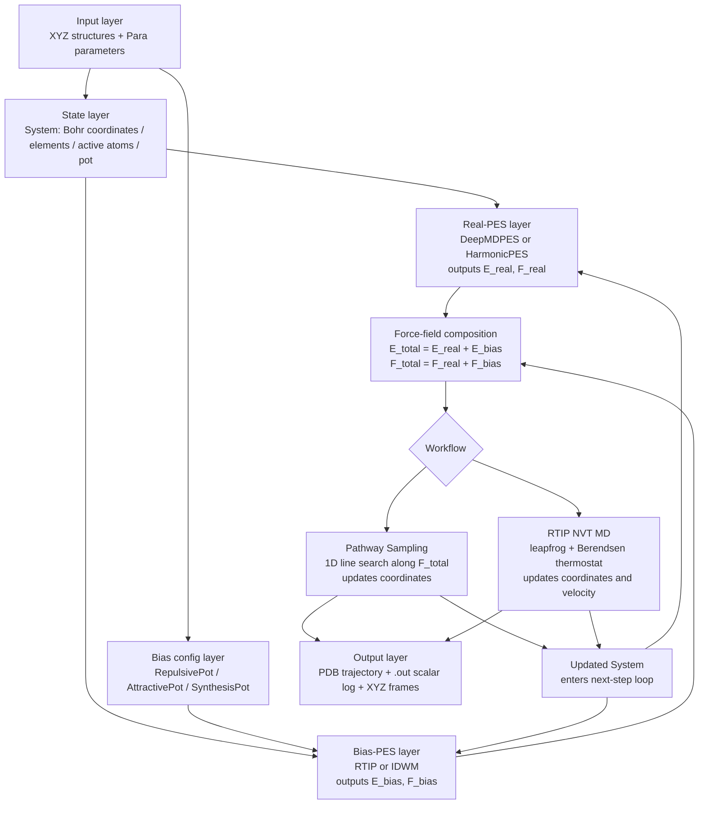
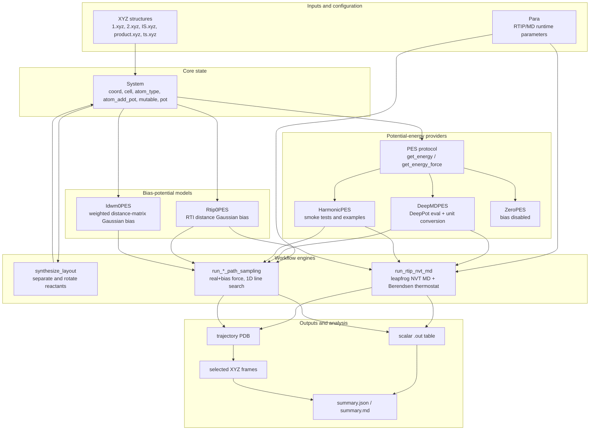
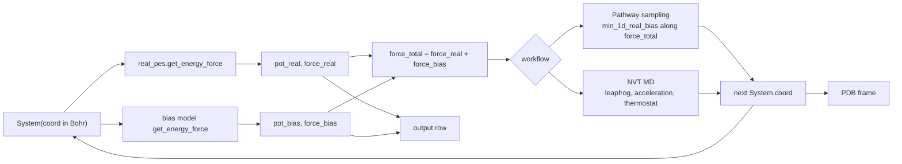

# RTIP/JAX Model Architecture

This note describes the computational model implemented by `rtip_jax`. In this
codebase, "model" means the RTIP/JAX simulation architecture: molecular state,
real potential-energy provider, bias potential, pathway/MD workflow, and
post-run analysis. It is not a neural network layer diagram.

## Model Architecture Workflow

This compact workflow is intended for Feishu/Lark docs as a model-architecture
overview. It describes the core computation chain for one RTIP/JAX simulation
without source-level detail.



| Layer | Input | Core operation | Output |
| --- | --- | --- | --- |
| Input layer | XYZ structures, `Para` parameters | Read structures and convert units | Initial `System` |
| Real-PES layer | `System` | `PES.get_energy_force()` | `E_real`, `F_real` |
| Bias-PES layer | `System` + bias config | RTIP/IDWM structural distance and Gaussian bias | `E_bias`, `F_bias` |
| Composition layer | real PES + bias PES | Sum energies and forces | `E_total`, `F_total` |
| Workflow layer | `E_total`, `F_total` | Pathway line search or NVT MD integration | Next-step `System` |
| Output layer | Per-step `System` and scalar values | Write trajectory and logs | `.pdb`, `.out`, `.xyz` |

## Source Module Inventory

The architecture below is built from the source modules under
`rtipmd/jax/src/rtip_jax`. Tests and research runners are verification or
application layers, so they are not part of this module inventory.

### Top-Level Modules

| Module | Main objects | Role in the architecture |
| --- | --- | --- |
| `rtip_jax/__init__.py` | `Element`, `Para`, `System`, `configure_jax` | Package public entry point; enables JAX x64 on import. |
| `rtip_jax/_config.py` | `configure_jax`, `is_x64_enabled` | Runtime JAX configuration, especially x64 behavior matching Rust `f64`. |
| `rtip_jax/constants.py` | physical constants, unit conversions, `Element`, `atomic_mass` | Constants, element parsing, masses, and unit conversion factors used by IO, DeePMD, and MD. |
| `rtip_jax/config.py` | `Para`, `load_para`, `format_default_para` | Runtime parameter model for pathway sampling and MD. |
| `rtip_jax/system.py` | `System` | Immutable molecular state: coordinates, cell, atom types, active bias atom subset, mutability mask, and stored potential. |
| `rtip_jax/errors.py` | RTIP exception classes and message helpers | Shared typed errors for input, elements, masses, and optimization. |
| `rtip_jax/cli.py` | CLI subcommands | User-facing commands for config display, synthesis, mock runs, DeePMD pathway, and DeePMD MD. |
| `rtip_jax/py.typed` | packaging marker | Marks the package as typed for downstream tooling. |

### Core Numerical Modules

| Module | Main objects | Role in the architecture |
| --- | --- | --- |
| `rtip_jax/core/__init__.py` | package exports | Re-exports core kernels. |
| `rtip_jax/core/rtip.py` | `Rtip0PES`, `rti_dist`, `rti_pot_force`, quaternion helpers | Roto-translationally invariant distance and RTIP Gaussian bias energy/force. |
| `rtip_jax/core/idwm.py` | `Idwm0PES`, `wei_dist_mat`, `idw_dist`, `idw_pot_force` | Interatomic distance weighted metric and IDWM Gaussian bias energy/force. |
| `rtip_jax/core/optimization.py` | `min_1d`, `min_1d_real_bias` | Rust-style one-dimensional search along the total-force direction. |

### PES and Bias Modules

| Module | Main objects | Role in the architecture |
| --- | --- | --- |
| `rtip_jax/pes/__init__.py` | package exports | Re-exports PES interfaces and bias config containers. |
| `rtip_jax/pes/base.py` | `PES`, `SumPES`, `ZeroPES`, `HarmonicPES`, `EnergyForce` | Shared potential-energy provider protocol and simple PES implementations. |
| `rtip_jax/pes/bias.py` | `RepulsivePot`, `AttractivePot`, `SynthesisPot` | Workflow-level bias configuration containers used by pathway sampling and MD. |

### Workflow Modules

| Module | Main objects | Role in the architecture |
| --- | --- | --- |
| `rtip_jax/workflows/__init__.py` | package exports | Re-exports pathway, MD, and synthesis workflow APIs. |
| `rtip_jax/workflows/pathway_sampling.py` | `run_rtip_repulsive_path_sampling`, `run_idwm_repulsive_path_sampling`, `run_rtip_attractive_path_sampling`, `run_rtip_synthesis_path_sampling` | Pathway loops: evaluate real/bias PES, combine forces, line-search updates, stopping state, and output rows. |
| `rtip_jax/workflows/md.py` | `run_rtip_nvt_md`, `atom_masses`, `temperature`, `leapfrog_first`, `leapfrog_second` | RTIP-biased NVT MD: masses, force-to-acceleration, leapfrog integration, kinetic energy, temperature, and thermostat. |
| `rtip_jax/workflows/synthesis.py` | `synthesize_layout`, `synthesis_offsets`, `synthesis_target_state` | Reactant layout generation and runtime synthesis target construction. |

### External Provider Modules

| Module | Main objects | Role in the architecture |
| --- | --- | --- |
| `rtip_jax/external/__init__.py` | package exports | Re-exports external PES boundaries. |
| `rtip_jax/external/deepmd.py` | `DeepMDBoundary`, `DeepMDPES`, `DeepMDResult`, `deepmd_inputs` | Production real-PES provider boundary; calls DeePMD and converts units back to RTIP internals. |
| `rtip_jax/external/cp2k.py` | `Cp2kBoundary`, `Cp2kPES` placeholder | Legacy CP2K contract retained as documentation; not an implemented JAX provider. |

### IO and Math Modules

| Module | Main objects | Role in the architecture |
| --- | --- | --- |
| `rtip_jax/io/__init__.py` | package exports | Re-exports XYZ, PDB, and output path helpers. |
| `rtip_jax/io/xyz.py` | `read_xyz`, `write_xyz`, `format_xyz` | XYZ boundary; reads/writes Angstrom text and stores internal Bohr coordinates. |
| `rtip_jax/io/pdb.py` | `write_pdb`, `format_pdb` | PDB trajectory output in Angstrom. |
| `rtip_jax/io/outputs.py` | `output_rtip`, `output_cp2k`, `RtipOutputPaths` | Standard output path generation for structure and scalar logs. |
| `rtip_jax/math/__init__.py` | package exports | Re-exports math helpers. |
| `rtip_jax/math/rotations.py` | `random_rotation`, `rotation_from_angles` | Rotation matrices used by synthesis layout. |

## High-Level Component Diagram



## Runtime Data Flow



## Bias Model Internals


## Mathematical Formulas

Unless noted otherwise, coordinates are internal Bohr coordinates. If
`atom_add_pot` is set, the RTIP/IDWM formulas are applied to that atom subset
and the resulting fragment force is scattered back into the full system.

### Total Energy and Force

For a real PES and one bias PES:

```math
E_\mathrm{total}(X) = E_\mathrm{real}(X) + E_\mathrm{bias}(X)
```

```math
F_\mathrm{total}(X) = F_\mathrm{real}(X) + F_\mathrm{bias}(X)
```

For `SumPES`, the code uses direct component sums:

```math
E(X)=\sum_m E_m(X), \qquad F(X)=\sum_m F_m(X)
```

Force norms used in output and stopping logic are:

```math
\|F\| = \sqrt{\sum_i \|F_i\|^2}, \qquad
F_\mathrm{rms} = \frac{\|F\|}{\sqrt{N}}
```

### RTIP Distance, Energy, and Force

For reference coordinates `R` and current coordinates `X`, first remove
translation:

```math
\bar r=\frac{1}{N}\sum_i r_i, \qquad
\bar x=\frac{1}{N}\sum_i x_i
```

```math
\tilde r_i=r_i-\bar r, \qquad
\tilde x_i=x_i-\bar x
```

For each atom define:

```math
a_i=\tilde r_i+\tilde x_i, \qquad b_i=\tilde r_i-\tilde x_i
```

The quaternion system matrix is:

```math
K = \sum_i A_i^\mathsf{T}A_i
```

with

```math
A_i =
\begin{bmatrix}
0 & b_x & b_y & b_z \\
-b_x & 0 & -a_z & a_y \\
-b_y & a_z & 0 & -a_x \\
-b_z & -a_y & a_x & 0
\end{bmatrix}_i
```

The eigenvalues are sorted by `jnp.linalg.eigh`:

```math
K q_k = \lambda_k q_k, \qquad
d_k = \sqrt{\max(\lambda_k, 0)}
```

The minimum roto-translationally invariant distance is:

```math
d_\mathrm{RTI}(R,X)=d_0
```

For quaternion `q=(q_0,q_1,q_2,q_3)`, the rotation matrix used by the code is:

```math
\operatorname{Rot}(q)=
\begin{bmatrix}
q_0^2+q_1^2-q_2^2-q_3^2 & 2(q_1q_2+q_0q_3) & 2(q_1q_3-q_0q_2) \\
2(q_1q_2-q_0q_3) & q_0^2-q_1^2+q_2^2-q_3^2 & 2(q_2q_3+q_0q_1) \\
2(q_1q_3+q_0q_2) & 2(q_2q_3-q_0q_1) & q_0^2-q_1^2-q_2^2+q_3^2
\end{bmatrix}
```

The aligned displacement vector for eigenmode `k` is:

```math
v_{k,i}=\tilde x_i-\tilde r_i\operatorname{Rot}(q_k)
```

RTIP uses four eigenmode distances with inverse-distance weights:

```math
w_k=d_k^{-7}, \qquad w'_k=-7d_k^{-8}, \qquad W=\sum_k w_k
```

The Gaussian term for one RTIP component is:

```math
u_k = a\exp\left(-\frac{d_k^2}{2\sigma^2}\right)
```

The RTIP energy is the weighted Gaussian sum:

```math
E_\mathrm{RTIP}(R,X;a,\sigma)=\sum_k \frac{w_k}{W}u_k
```

The code's force expression is:

```math
F_i=\sum_k c_k v_{k,i}
```

where

```math
c_k =
\frac{(w_k/W)u_k}{\sigma^2}
+
\frac{w'_k\left(\sum_j w_j u_j-u_k W\right)}{W^2 d_k}
```

`Rtip0PES` combines a local-minimum repulsion and optional nearby-TS
repulsions:

```math
E_\mathrm{bias}=E_\mathrm{RTIP}(R_\mathrm{min},X;a_\mathrm{min},\sigma_\mathrm{min})
+
\sum_t E_\mathrm{RTIP}(R_t,X;a_\mathrm{ts},\sigma_t)
```

For repulsive pathway or MD step `s`:

```math
a_\mathrm{min}=a_0 s, \qquad
a_\mathrm{ts}=a_0 s \cdot \mathrm{scale\_ts\_a0}
```

For attractive RTIP, the same Gaussian is used with a negative amplitude:

```math
a_\mathrm{min}=-a_0 s, \qquad a_\mathrm{ts}=0
```

When `scale_ts_sigma` is configured:

```math
\sigma_t=\frac{1}{2}\,\mathrm{scale\_ts\_sigma}\,
d_\mathrm{RTI}(R_t,R_\mathrm{min})
```

Otherwise:

```math
\sigma_t=d_\mathrm{RTI}(R_t,X)
```

### IDWM Distance, Energy, and Force

For current coordinates `X`, pairwise vectors and distances are:

```math
\Delta_{ij}=x_i-x_j, \qquad r_{ij}=\|\Delta_{ij}\|
```

Only the strict upper triangle is used. The distance weight is:

```math
w(r)=\exp\left[-\left(\frac{r}{3}\right)^5\right]+1
```

```math
w'(r)=\exp\left[-\left(\frac{r}{3}\right)^5\right]\left(-\frac{5r^4}{3^5}\right)
```

The weighted distance matrix is:

```math
W_{ij}(X)=
\begin{cases}
w(r_{ij}), & i<j \\
0, & i\ge j
\end{cases}
```

For reference matrix `W^0`, the IDWM distance is:

```math
D_\mathrm{IDWM}(W^0,X)=
\sqrt{\sum_{i<j}\left(W_{ij}(X)-W^0_{ij}\right)^2}
```

The Gaussian IDWM energy is:

```math
E_\mathrm{IDWM}(W^0,X;a,\sigma)=
a\exp\left(-\frac{D_\mathrm{IDWM}^2}{2\sigma^2}\right)
```

The force helper first builds:

```math
c_{ij}=
\frac{(W_{ij}-W^0_{ij})w'(r_{ij})}{r_{ij}}
\quad (i<j)
```

```math
p_{ij}=c_{ij}\Delta_{ij}
```

```math
v_i=\frac{\sum_j p_{ij}-\sum_j p_{ji}}{D_\mathrm{IDWM}}
```

Then:

```math
F_i=v_i E_\mathrm{IDWM}\frac{D_\mathrm{IDWM}}{\sigma^2}
```

`Idwm0PES` uses the same local-minimum and nearby-TS sum as `Rtip0PES`, but
with `E_IDWM` and IDWM distances.

### Pathway Sampling

Initial repulsive pathway perturbation uses a mean-centered random displacement
`D`:

```math
D \leftarrow D-\frac{1}{N}\sum_i D_i
```

```math
X_0=X_\mathrm{local\ min}+\mathrm{scale}\frac{D}{\|D\|}
```

At each pathway step, the line-search objective along the total-force direction
is:

```math
\phi(\alpha)=E_\mathrm{real}\left(X+\alpha\frac{F_\mathrm{total}}{\|F_\mathrm{total}\|}\right)
+
E_\mathrm{bias}\left(X+\alpha\frac{F_\mathrm{total}}{\|F_\mathrm{total}\|}\right)
```

The coordinate update is:

```math
\Delta X = \alpha_\mathrm{min}\frac{F_\mathrm{total}}{\|F_\mathrm{total}\|}
```

```math
X \leftarrow X+\Delta X
```

The line-search energy tolerance passed by the workflow is:

```math
\epsilon_\mathrm{line}=\mathrm{pot\_epsilon}\cdot N
```

Repulsive stopping state:

```math
E_\mathrm{max}^{(s)}=\max(E_\mathrm{max}^{(s-1)},E_\mathrm{real}^{(s)}), \qquad
E_\mathrm{min}^{(s)}=\min(E_\mathrm{min}^{(s-1)},E_\mathrm{real}^{(s)})
```

Bias is turned off if:

```math
E_\mathrm{real}^{(s)} < E_\mathrm{max}^{(s)}-\mathrm{pot\_drop}
```

The workflow stops after bias is off and:

```math
\frac{\|F_\mathrm{real}\|}{\sqrt{N}} < \mathrm{f\_epsilon}
```

It also stops on excessive climb or bias force:

```math
E_\mathrm{real}^{(s)} > E_\mathrm{min}^{(s)}+\mathrm{pot\_climb}
\quad\mathrm{or}\quad
\|F_\mathrm{bias}\|>1000
```

Attractive pathway turns off bias when:

```math
\sigma_\mathrm{min}<1 \quad\mathrm{or}\quad \|F_\mathrm{bias}\|>1000
```

### NVT MD

Atomic masses are in atomic units. Kinetic energy is:

```math
K=\frac{1}{2}\sum_i m_i\|v_i\|^2
```

The instantaneous temperature is:

```math
T=
\frac{\left(\sum_i m_i\|v_i\|^2\right)\mathrm{HARTREE\_TO\_JOULE}}
{k_B\,3(N-1)}
```

The Berendsen thermostat factor is:

```math
\lambda=
\sqrt{
1+\frac{\Delta t_\mathrm{fs}}{\tau}
\left(\frac{T_\mathrm{bath}}{\max(T,1)}-1\right)
}
```

For integration, convert femtoseconds to atomic time:

```math
\Delta t_\mathrm{au}=\Delta t_\mathrm{fs}\cdot\mathrm{FEMTOSECOND\_TO\_AU}
```

Acceleration is:

```math
a_i=\frac{F_{\mathrm{total},i}}{m_i}
```

The leapfrog update is:

```math
v_{n+1/2}=v_n+\frac{1}{2}\Delta t_\mathrm{au}a_n
```

```math
x_{n+1}=x_n+\Delta t_\mathrm{au}v_{n+1/2}
```

After recomputing forces at `x_{n+1}`:

```math
v_{n+1}=\left(v_{n+1/2}+\frac{1}{2}\Delta t_\mathrm{au}a_{n+1}\right)\lambda
```

### Synthesis Layout

For molecule `m`, with center `c_m`, rotation `R_m`, and offset `o_m`:

```math
x_i'=(x_i-c_m)R_m+o_m, \qquad i\in m
```

Offsets for two molecules:

```math
(-d,0,0), \qquad (d,0,0)
```

Offsets for three molecules:

```math
(0,d,0), \qquad
\left(\frac{\sqrt{3}}{2}d,-\frac{1}{2}d,0\right), \qquad
\left(-\frac{\sqrt{3}}{2}d,-\frac{1}{2}d,0\right)
```

Offsets for four molecules:

```math
(0,0,d), \qquad
\left(0,\frac{2\sqrt{2}}{3}d,-\frac{1}{3}d\right), \qquad
\left(\sqrt{\frac{2}{3}}d,-\frac{\sqrt{2}}{3}d,-\frac{1}{3}d\right), \qquad
\left(-\sqrt{\frac{2}{3}}d,-\frac{\sqrt{2}}{3}d,-\frac{1}{3}d\right)
```

The runtime synthesis target moves each selected molecule center to the common
selected-atom center:

```math
c_\mathrm{all}=\frac{1}{N_\mathrm{sel}}\sum_{i\in\mathrm{selected}}x_i
```

```math
x_i^\mathrm{target}=x_i-c_m+c_\mathrm{all}, \qquad i\in m
```

Random rotations use angles `alpha`, `beta`, and `gamma` sampled in
`[0, 2*pi)` and the matrix:

```math
R(\alpha,\beta,\gamma)=
\begin{bmatrix}
\cos\alpha\cos\gamma-\cos\beta\sin\alpha\sin\gamma &
-\cos\beta\cos\gamma\sin\alpha-\cos\alpha\sin\gamma &
\sin\alpha\sin\beta \\
\cos\gamma\sin\alpha+\cos\alpha\cos\beta\sin\gamma &
\cos\alpha\cos\beta\cos\gamma-\sin\alpha\sin\gamma &
-\cos\alpha\sin\beta \\
\sin\beta\sin\gamma &
\cos\gamma\sin\beta &
\cos\beta
\end{bmatrix}
```

### Unit Conversion and Simple PES Helpers

XYZ and PDB files use Angstrom, while internal coordinates use Bohr:

```math
X_\mathrm{Angstrom}=X_\mathrm{Bohr}\cdot\mathrm{BOHR\_TO\_ANGSTROM}
```

```math
X_\mathrm{Bohr}=X_\mathrm{Angstrom}\cdot\mathrm{ANGSTROM\_TO\_BOHR}
```

DeePMD energy and force are converted back to internal units:

```math
E_\mathrm{Ha}=E_\mathrm{eV}\cdot\mathrm{EV\_TO\_HARTREE}
```

```math
F_{\mathrm{Ha/Bohr}}=
F_{\mathrm{eV/Angstrom}}\cdot
\mathrm{EV\_PER\_ANGSTROM\_TO\_HARTREE\_PER\_BOHR}
```

with:

```math
\mathrm{EV\_PER\_ANGSTROM\_TO\_HARTREE\_PER\_BOHR}
=
\frac{\mathrm{EV\_TO\_HARTREE}}{\mathrm{ANGSTROM\_TO\_BOHR}}
```

`HarmonicPES` is:

```math
E_\mathrm{harmonic}=\frac{1}{2}k\sum_i\|x_i-c_i\|^2, \qquad
F_i=-k(x_i-c_i)
```

`ZeroPES` is:

```math
E=0, \qquad F_i=0
```

## Execution Modes

| Mode | Config object | Bias provider | Workflow | Primary use |
| --- | --- | --- | --- | --- |
| Repulsive pathway | `RepulsivePot` | `Rtip0PES` or `Idwm0PES` | `run_rtip_repulsive_path_sampling` / `run_idwm_repulsive_path_sampling` | Escape from a local minimum. |
| Attractive pathway | `AttractivePot` | attractive `Rtip0PES` | `run_rtip_attractive_path_sampling` | Pull an initial state toward a reference final/TS geometry. |
| Synthesis pathway | `SynthesisPot` | attractive `Rtip0PES` to a runtime target | `run_rtip_synthesis_path_sampling` | Bring separated reactants together. |
| RTIP NVT MD | `RepulsivePot`, `AttractivePot`, or `SynthesisPot` | RTIP bias | `run_rtip_nvt_md` | Biased molecular dynamics with a thermostat. |

## Unit Boundaries

Internal RTIP/JAX state uses Bohr coordinates, Hartree energies, and
Hartree/Bohr forces. XYZ input/output uses Angstrom. DeePMD inference uses
Angstrom coordinates and eV/eV-per-Angstrom outputs, so all conversion is
isolated in `external/deepmd.py`.

## Rust-to-JAX Relationship

The Rust implementation remains the historical reference under
`rtipmd/rust/src/pes_exploration`. The JAX package mirrors the Rust modules:
`system`, `potential`, `rtip`, `idwm`, `optimization`, `synthesis`,
`pathway_sampling`, and `md`. CP2K is retained only as a documented legacy
boundary; production real-PES evaluation is supplied by DeePMD.
