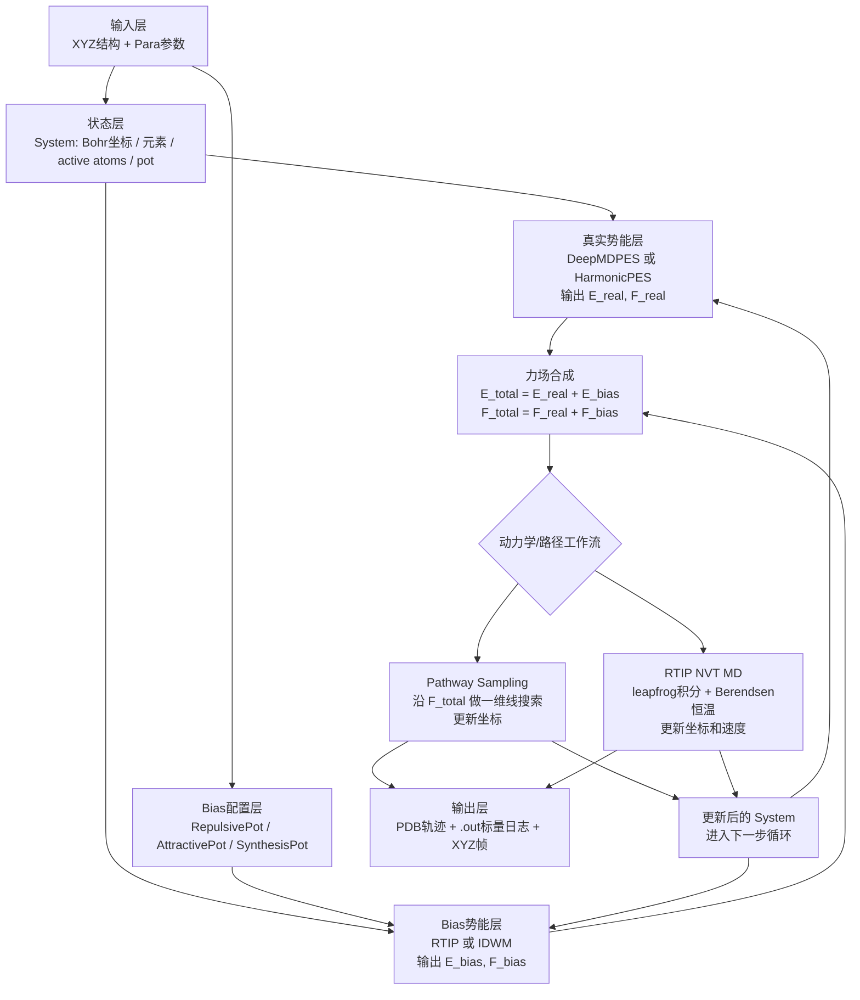
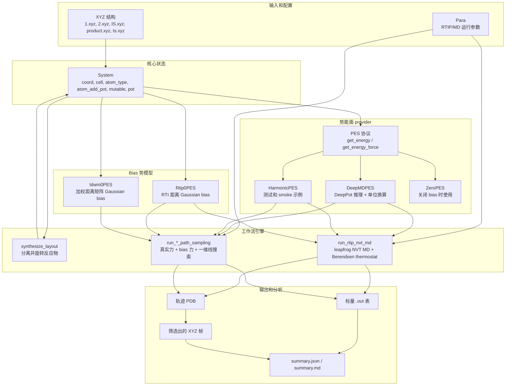
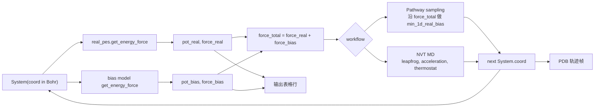

# RTIP/JAX 模型架构图

这份说明描述 `rtip_jax` 实现的计算模型。这里的“模型”指 RTIP/JAX 的仿真架构：
分子状态、真实势能 provider、bias 势、pathway/MD 工作流和结果分析；它不是神经网络层结构图。

## 模型架构 Workflow（飞书版）

下面这版适合放进飞书文档作为模型架构总览：它不展开源码细节，只说明 RTIP/JAX
一次仿真的核心计算链路。



| 层级 | 输入 | 核心处理 | 输出 |
| --- | --- | --- | --- |
| 输入层 | XYZ结构、`Para`参数 | 读取结构并完成单位转换 | `System` 初始状态 |
| 真实势能层 | `System` | `PES.get_energy_force()` | `E_real`, `F_real` |
| Bias势能层 | `System` + bias配置 | RTIP/IDWM 结构距离与 Gaussian bias | `E_bias`, `F_bias` |
| 合成层 | real PES + bias PES | 能量和力相加 | `E_total`, `F_total` |
| Workflow层 | `E_total`, `F_total` | Pathway一维线搜索或NVT MD积分 | 下一步 `System` |
| 输出层 | 每一步 `System` 和标量量 | 写出轨迹与日志 | `.pdb`, `.out`, `.xyz` |

## 源码模块清单

下面的架构来自 `rtipmd/jax/src/rtip_jax` 下的源码模块。测试和 research runner 属于验证层或应用层，
不放进这里的主模块清单。

### 顶层模块

| 模块 | 主要对象 | 架构职责 |
| --- | --- | --- |
| `rtip_jax/__init__.py` | `Element`, `Para`, `System`, `configure_jax` | 包的公开入口；导入时启用 JAX x64。 |
| `rtip_jax/_config.py` | `configure_jax`, `is_x64_enabled` | JAX 运行配置，尤其是与 Rust `f64` 对齐的 x64 行为。 |
| `rtip_jax/constants.py` | 物理常数、单位换算、`Element`、`atomic_mass` | 常数、元素解析、原子质量，以及 IO、DeePMD、MD 共用的单位换算因子。 |
| `rtip_jax/config.py` | `Para`, `load_para`, `format_default_para` | pathway sampling 和 MD 的运行参数模型。 |
| `rtip_jax/system.py` | `System` | 不可变分子状态：坐标、晶胞、元素类型、active bias 原子子集、可动性 mask、势能。 |
| `rtip_jax/errors.py` | RTIP 异常类和错误信息 helper | 输入、元素、质量和优化相关的共享类型化错误。 |
| `rtip_jax/cli.py` | CLI 子命令 | 用户命令入口：配置查看、synthesis、mock run、DeePMD pathway、DeePMD MD。 |
| `rtip_jax/py.typed` | packaging marker | 标记该包对下游类型工具可见。 |

### 核心数值模块

| 模块 | 主要对象 | 架构职责 |
| --- | --- | --- |
| `rtip_jax/core/__init__.py` | package exports | 重新导出 core kernels。 |
| `rtip_jax/core/rtip.py` | `Rtip0PES`, `rti_dist`, `rti_pot_force`, 四元数 helper | 旋转/平移不变距离，以及 RTIP Gaussian bias 的能量和力。 |
| `rtip_jax/core/idwm.py` | `Idwm0PES`, `wei_dist_mat`, `idw_dist`, `idw_pot_force` | 原子间距离加权矩阵度量，以及 IDWM Gaussian bias 的能量和力。 |
| `rtip_jax/core/optimization.py` | `min_1d`, `min_1d_real_bias` | 沿总力方向的一维搜索，复刻 Rust 行为。 |

### PES 和 Bias 模块

| 模块 | 主要对象 | 架构职责 |
| --- | --- | --- |
| `rtip_jax/pes/__init__.py` | package exports | 重新导出 PES interface 和 bias config containers。 |
| `rtip_jax/pes/base.py` | `PES`, `SumPES`, `ZeroPES`, `HarmonicPES`, `EnergyForce` | 共享势能 provider 协议，以及简单 PES 实现。 |
| `rtip_jax/pes/bias.py` | `RepulsivePot`, `AttractivePot`, `SynthesisPot` | workflow 级 bias 配置容器，供 pathway sampling 和 MD 使用。 |

### 工作流模块

| 模块 | 主要对象 | 架构职责 |
| --- | --- | --- |
| `rtip_jax/workflows/__init__.py` | package exports | 重新导出 pathway、MD 和 synthesis workflow API。 |
| `rtip_jax/workflows/pathway_sampling.py` | `run_rtip_repulsive_path_sampling`, `run_idwm_repulsive_path_sampling`, `run_rtip_attractive_path_sampling`, `run_rtip_synthesis_path_sampling` | Pathway 循环：评估真实/bias PES、合并力、一维搜索更新、停止状态、输出标量行。 |
| `rtip_jax/workflows/md.py` | `run_rtip_nvt_md`, `atom_masses`, `temperature`, `leapfrog_first`, `leapfrog_second` | RTIP-biased NVT MD：质量、力到加速度、leapfrog 积分、动能、温度和 thermostat。 |
| `rtip_jax/workflows/synthesis.py` | `synthesize_layout`, `synthesis_offsets`, `synthesis_target_state` | 反应物 layout 生成，以及运行时 synthesis target 构造。 |

### 外部 Provider 模块

| 模块 | 主要对象 | 架构职责 |
| --- | --- | --- |
| `rtip_jax/external/__init__.py` | package exports | 重新导出外部 PES 边界。 |
| `rtip_jax/external/deepmd.py` | `DeepMDBoundary`, `DeepMDPES`, `DeepMDResult`, `deepmd_inputs` | 生产级真实 PES provider 边界；调用 DeePMD 并把单位转回 RTIP 内部单位。 |
| `rtip_jax/external/cp2k.py` | `Cp2kBoundary`, `Cp2kPES` placeholder | 保留 legacy CP2K 契约作为文档；不是已实现的 JAX provider。 |

### IO 和数学模块

| 模块 | 主要对象 | 架构职责 |
| --- | --- | --- |
| `rtip_jax/io/__init__.py` | package exports | 重新导出 XYZ、PDB 和输出路径 helper。 |
| `rtip_jax/io/xyz.py` | `read_xyz`, `write_xyz`, `format_xyz` | XYZ 边界；读写 Angstrom 文本，内部存储 Bohr 坐标。 |
| `rtip_jax/io/pdb.py` | `write_pdb`, `format_pdb` | PDB 轨迹输出，使用 Angstrom。 |
| `rtip_jax/io/outputs.py` | `output_rtip`, `output_cp2k`, `RtipOutputPaths` | 生成结构轨迹和标量日志的标准输出路径。 |
| `rtip_jax/math/__init__.py` | package exports | 重新导出数学 helper。 |
| `rtip_jax/math/rotations.py` | `random_rotation`, `rotation_from_angles` | synthesis layout 使用的旋转矩阵。 |

## 总体组件图



## 运行时数据流



## Bias 模型内部结构

```mermaid
flowchart TB
    subgraph RTIP["RTIP bias: core/rtip.py"]
        R1["参考坐标 + 当前坐标"] --> R2["去平移\n坐标中心化"]
        R2 --> R3["四元数本征系统"]
        R3 --> R4["4 个 RTI 距离和向量"]
        R4 --> R5["1 / distance^7 权重"]
        R5 --> R6["Gaussian 能量 + 力"]
        R6 --> R7["Rtip0PES"]
    end

    subgraph IDWM["IDWM bias: core/idwm.py"]
        I1["坐标"] --> I2["原子对距离"]
        I2 --> I3["加权距离矩阵\nexp(-(d/3)^5)+1"]
        I3 --> I4["到参考矩阵的距离"]
        I4 --> I5["Gaussian 能量 + 力"]
        I5 --> I6["Idwm0PES"]
    end
```



## 涉及公式

除非特别说明，下面坐标都采用 RTIP/JAX 内部 Bohr 单位。如果 `atom_add_pot`
被设置，RTIP/IDWM 公式只作用在该原子子集上，随后把 fragment force scatter 回完整体系。

### 总能量和总力

真实 PES 与一个 bias PES 组合时：

```math
E_\mathrm{total}(X) = E_\mathrm{real}(X) + E_\mathrm{bias}(X)
```

```math
F_\mathrm{total}(X) = F_\mathrm{real}(X) + F_\mathrm{bias}(X)
```

`SumPES` 使用 component 直接求和：

```math
E(X)=\sum_m E_m(X), \qquad F(X)=\sum_m F_m(X)
```

输出和停止判据使用的力范数为：

```math
\|F\| = \sqrt{\sum_i \|F_i\|^2}, \qquad
F_\mathrm{rms} = \frac{\|F\|}{\sqrt{N}}
```

### RTIP 距离、能量和力

给定参考坐标 `R` 和当前坐标 `X`，先去平移：

```math
\bar r=\frac{1}{N}\sum_i r_i, \qquad
\bar x=\frac{1}{N}\sum_i x_i
```

```math
\tilde r_i=r_i-\bar r, \qquad
\tilde x_i=x_i-\bar x
```

对每个原子定义：

```math
a_i=\tilde r_i+\tilde x_i, \qquad b_i=\tilde r_i-\tilde x_i
```

四元数系统矩阵为：

```math
K = \sum_i A_i^\mathsf{T}A_i
```

其中：

```math
A_i =
\begin{bmatrix}
0 & b_x & b_y & b_z \\
-b_x & 0 & -a_z & a_y \\
-b_y & a_z & 0 & -a_x \\
-b_z & -a_y & a_x & 0
\end{bmatrix}_i
```

`jnp.linalg.eigh` 返回排序后的本征值/本征向量：

```math
K q_k = \lambda_k q_k, \qquad
d_k = \sqrt{\max(\lambda_k, 0)}
```

最小旋转/平移不变距离为：

```math
d_\mathrm{RTI}(R,X)=d_0
```

四元数 `q=(q_0,q_1,q_2,q_3)` 对应的旋转矩阵为：

```math
\operatorname{Rot}(q)=
\begin{bmatrix}
q_0^2+q_1^2-q_2^2-q_3^2 & 2(q_1q_2+q_0q_3) & 2(q_1q_3-q_0q_2) \\
2(q_1q_2-q_0q_3) & q_0^2-q_1^2+q_2^2-q_3^2 & 2(q_2q_3+q_0q_1) \\
2(q_1q_3+q_0q_2) & 2(q_2q_3-q_0q_1) & q_0^2-q_1^2-q_2^2+q_3^2
\end{bmatrix}
```

第 `k` 个 eigenmode 的对齐位移向量为：

```math
v_{k,i}=\tilde x_i-\tilde r_i\operatorname{Rot}(q_k)
```

RTIP 使用 4 个 eigenmode 距离和反距离权重：

```math
w_k=d_k^{-7}, \qquad w'_k=-7d_k^{-8}, \qquad W=\sum_k w_k
```

单个 Gaussian 项为：

```math
u_k = a\exp\left(-\frac{d_k^2}{2\sigma^2}\right)
```

RTIP 能量是加权 Gaussian 和：

```math
E_\mathrm{RTIP}(R,X;a,\sigma)=\sum_k \frac{w_k}{W}u_k
```

代码中的力表达式为：

```math
F_i=\sum_k c_k v_{k,i}
```

其中：

```math
c_k =
\frac{(w_k/W)u_k}{\sigma^2}
+
\frac{w'_k\left(\sum_j w_j u_j-u_k W\right)}{W^2 d_k}
```

`Rtip0PES` 把 local-minimum repulsion 与可选 nearby-TS repulsion 相加：

```math
E_\mathrm{bias}=E_\mathrm{RTIP}(R_\mathrm{min},X;a_\mathrm{min},\sigma_\mathrm{min})
+
\sum_t E_\mathrm{RTIP}(R_t,X;a_\mathrm{ts},\sigma_t)
```

在 repulsive pathway 或 MD 的第 `s` 步：

```math
a_\mathrm{min}=a_0 s, \qquad
a_\mathrm{ts}=a_0 s \cdot \mathrm{scale\_ts\_a0}
```

Attractive RTIP 使用负振幅：

```math
a_\mathrm{min}=-a_0 s, \qquad a_\mathrm{ts}=0
```

如果设置了 `scale_ts_sigma`：

```math
\sigma_t=\frac{1}{2}\,\mathrm{scale\_ts\_sigma}\,
d_\mathrm{RTI}(R_t,R_\mathrm{min})
```

否则：

```math
\sigma_t=d_\mathrm{RTI}(R_t,X)
```

### IDWM 距离、能量和力

对当前坐标 `X`，原子对向量和距离为：

```math
\Delta_{ij}=x_i-x_j, \qquad r_{ij}=\|\Delta_{ij}\|
```

IDWM 只使用严格上三角。距离权重为：

```math
w(r)=\exp\left[-\left(\frac{r}{3}\right)^5\right]+1
```

```math
w'(r)=\exp\left[-\left(\frac{r}{3}\right)^5\right]\left(-\frac{5r^4}{3^5}\right)
```

加权距离矩阵为：

```math
W_{ij}(X)=
\begin{cases}
w(r_{ij}), & i<j \\
0, & i\ge j
\end{cases}
```

给定参考矩阵 `W^0`，IDWM 距离为：

```math
D_\mathrm{IDWM}(W^0,X)=
\sqrt{\sum_{i<j}\left(W_{ij}(X)-W^0_{ij}\right)^2}
```

Gaussian IDWM 能量为：

```math
E_\mathrm{IDWM}(W^0,X;a,\sigma)=
a\exp\left(-\frac{D_\mathrm{IDWM}^2}{2\sigma^2}\right)
```

力计算先构造：

```math
c_{ij}=
\frac{(W_{ij}-W^0_{ij})w'(r_{ij})}{r_{ij}}
\quad (i<j)
```

```math
p_{ij}=c_{ij}\Delta_{ij}
```

```math
v_i=\frac{\sum_j p_{ij}-\sum_j p_{ji}}{D_\mathrm{IDWM}}
```

随后：

```math
F_i=v_i E_\mathrm{IDWM}\frac{D_\mathrm{IDWM}}{\sigma^2}
```

`Idwm0PES` 与 `Rtip0PES` 一样叠加 local-minimum 和 nearby-TS 项，只是使用
`E_IDWM` 与 IDWM 距离。

### Pathway Sampling

Repulsive pathway 的初始扰动使用均值中心化随机位移 `D`：

```math
D \leftarrow D-\frac{1}{N}\sum_i D_i
```

```math
X_0=X_\mathrm{local\ min}+\mathrm{scale}\frac{D}{\|D\|}
```

每一步沿总力方向做一维搜索，目标函数为：

```math
\phi(\alpha)=E_\mathrm{real}\left(X+\alpha\frac{F_\mathrm{total}}{\|F_\mathrm{total}\|}\right)
+
E_\mathrm{bias}\left(X+\alpha\frac{F_\mathrm{total}}{\|F_\mathrm{total}\|}\right)
```

坐标更新为：

```math
\Delta X = \alpha_\mathrm{min}\frac{F_\mathrm{total}}{\|F_\mathrm{total}\|}
```

```math
X \leftarrow X+\Delta X
```

workflow 传给 line search 的能量容差为：

```math
\epsilon_\mathrm{line}=\mathrm{pot\_epsilon}\cdot N
```

Repulsive 停止状态：

```math
E_\mathrm{max}^{(s)}=\max(E_\mathrm{max}^{(s-1)},E_\mathrm{real}^{(s)}), \qquad
E_\mathrm{min}^{(s)}=\min(E_\mathrm{min}^{(s-1)},E_\mathrm{real}^{(s)})
```

满足下式时关闭 bias：

```math
E_\mathrm{real}^{(s)} < E_\mathrm{max}^{(s)}-\mathrm{pot\_drop}
```

bias 已关闭且满足下式时停止：

```math
\frac{\|F_\mathrm{real}\|}{\sqrt{N}} < \mathrm{f\_epsilon}
```

过度爬坡或 bias 力过大也会停止：

```math
E_\mathrm{real}^{(s)} > E_\mathrm{min}^{(s)}+\mathrm{pot\_climb}
\quad\mathrm{or}\quad
\|F_\mathrm{bias}\|>1000
```

Attractive pathway 满足下式时关闭 bias：

```math
\sigma_\mathrm{min}<1 \quad\mathrm{or}\quad \|F_\mathrm{bias}\|>1000
```

### NVT MD

原子质量使用原子单位。动能为：

```math
K=\frac{1}{2}\sum_i m_i\|v_i\|^2
```

瞬时温度为：

```math
T=
\frac{\left(\sum_i m_i\|v_i\|^2\right)\mathrm{HARTREE\_TO\_JOULE}}
{k_B\,3(N-1)}
```

Berendsen thermostat 缩放因子为：

```math
\lambda=
\sqrt{
1+\frac{\Delta t_\mathrm{fs}}{\tau}
\left(\frac{T_\mathrm{bath}}{\max(T,1)}-1\right)
}
```

积分时先把 fs 转成原子时间：

```math
\Delta t_\mathrm{au}=\Delta t_\mathrm{fs}\cdot\mathrm{FEMTOSECOND\_TO\_AU}
```

加速度为：

```math
a_i=\frac{F_{\mathrm{total},i}}{m_i}
```

Leapfrog 更新：

```math
v_{n+1/2}=v_n+\frac{1}{2}\Delta t_\mathrm{au}a_n
```

```math
x_{n+1}=x_n+\Delta t_\mathrm{au}v_{n+1/2}
```

在 `x_{n+1}` 重新计算力以后：

```math
v_{n+1}=\left(v_{n+1/2}+\frac{1}{2}\Delta t_\mathrm{au}a_{n+1}\right)\lambda
```

### Synthesis Layout

对分子 `m`，设其几何中心为 `c_m`，旋转矩阵为 `R_m`，offset 为 `o_m`：

```math
x_i'=(x_i-c_m)R_m+o_m, \qquad i\in m
```

2 个分子的 offset：

```math
(-d,0,0), \qquad (d,0,0)
```

3 个分子的 offset：

```math
(0,d,0), \qquad
\left(\frac{\sqrt{3}}{2}d,-\frac{1}{2}d,0\right), \qquad
\left(-\frac{\sqrt{3}}{2}d,-\frac{1}{2}d,0\right)
```

4 个分子的 offset：

```math
(0,0,d), \qquad
\left(0,\frac{2\sqrt{2}}{3}d,-\frac{1}{3}d\right), \qquad
\left(\sqrt{\frac{2}{3}}d,-\frac{\sqrt{2}}{3}d,-\frac{1}{3}d\right), \qquad
\left(-\sqrt{\frac{2}{3}}d,-\frac{\sqrt{2}}{3}d,-\frac{1}{3}d\right)
```

运行时 synthesis target 会把每个被选中分子的中心移到共同中心：

```math
c_\mathrm{all}=\frac{1}{N_\mathrm{sel}}\sum_{i\in\mathrm{selected}}x_i
```

```math
x_i^\mathrm{target}=x_i-c_m+c_\mathrm{all}, \qquad i\in m
```

随机旋转使用从 `[0, 2*pi)` 采样的 `alpha`、`beta`、`gamma`，矩阵为：

```math
R(\alpha,\beta,\gamma)=
\begin{bmatrix}
\cos\alpha\cos\gamma-\cos\beta\sin\alpha\sin\gamma &
-\cos\beta\cos\gamma\sin\alpha-\cos\alpha\sin\gamma &
\sin\alpha\sin\beta \\
\cos\gamma\sin\alpha+\cos\alpha\cos\beta\sin\gamma &
\cos\alpha\cos\beta\cos\gamma-\sin\alpha\sin\gamma &
-\cos\alpha\sin\beta \\
\sin\beta\sin\gamma &
\cos\gamma\sin\beta &
\cos\beta
\end{bmatrix}
```

### 单位换算和简单 PES

XYZ/PDB 使用 Angstrom，内部坐标使用 Bohr：

```math
X_\mathrm{Angstrom}=X_\mathrm{Bohr}\cdot\mathrm{BOHR\_TO\_ANGSTROM}
```

```math
X_\mathrm{Bohr}=X_\mathrm{Angstrom}\cdot\mathrm{ANGSTROM\_TO\_BOHR}
```

DeePMD 能量和力转换回内部单位：

```math
E_\mathrm{Ha}=E_\mathrm{eV}\cdot\mathrm{EV\_TO\_HARTREE}
```

```math
F_{\mathrm{Ha/Bohr}}=
F_{\mathrm{eV/Angstrom}}\cdot
\mathrm{EV\_PER\_ANGSTROM\_TO\_HARTREE\_PER\_BOHR}
```

其中：

```math
\mathrm{EV\_PER\_ANGSTROM\_TO\_HARTREE\_PER\_BOHR}
=
\frac{\mathrm{EV\_TO\_HARTREE}}{\mathrm{ANGSTROM\_TO\_BOHR}}
```

`HarmonicPES` 为：

```math
E_\mathrm{harmonic}=\frac{1}{2}k\sum_i\|x_i-c_i\|^2, \qquad
F_i=-k(x_i-c_i)
```

`ZeroPES` 为：

```math
E=0, \qquad F_i=0
```

## 执行模式

| 模式 | Config object | Bias provider | Workflow | 主要用途 |
| --- | --- | --- | --- | --- |
| Repulsive pathway | `RepulsivePot` | `Rtip0PES` 或 `Idwm0PES` | `run_rtip_repulsive_path_sampling` / `run_idwm_repulsive_path_sampling` | 从局部极小点逃逸。 |
| Attractive pathway | `AttractivePot` | attractive `Rtip0PES` | `run_rtip_attractive_path_sampling` | 把初态拉向参考终态/TS。 |
| Synthesis pathway | `SynthesisPot` | 指向运行时 target 的 attractive `Rtip0PES` | `run_rtip_synthesis_path_sampling` | 把分离反应物拉近。 |
| RTIP NVT MD | `RepulsivePot`、`AttractivePot` 或 `SynthesisPot` | RTIP bias | `run_rtip_nvt_md` | 带 thermostat 的 bias 分子动力学。 |

## 单位边界

RTIP/JAX 内部使用 Bohr 坐标、Hartree 能量和 Hartree/Bohr 力。XYZ 输入/输出使用
Angstrom。DeePMD 推理使用 Angstrom 坐标和 eV/eV-per-Angstrom 输出，因此所有转换都封装在
`external/deepmd.py`。

## Rust 与 JAX 的关系

Rust 实现仍作为历史参考保留在 `rtipmd/rust/src/pes_exploration`。JAX 包镜像了 Rust
模块：`system`、`potential`、`rtip`、`idwm`、`optimization`、`synthesis`、
`pathway_sampling` 和 `md`。CP2K 现在只保留为 legacy boundary 文档；生产级真实 PES
由 DeePMD 提供。
